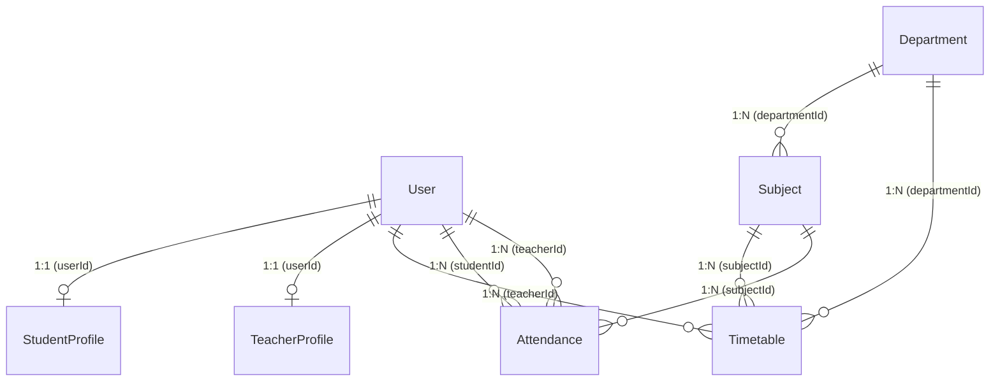
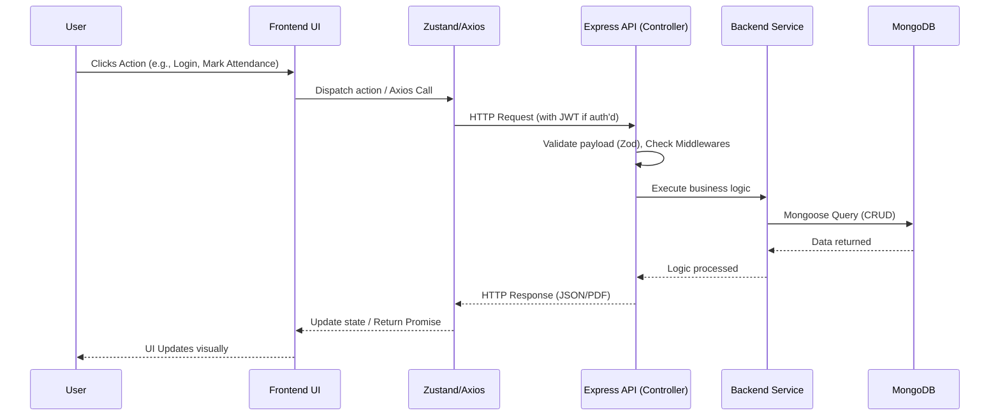
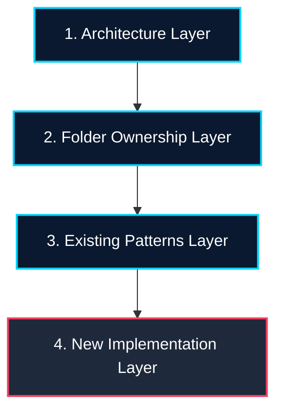

# AGENT.md

## Project Overview

- **Project name**: Smart Attendance Management System (SAMS)
- **Purpose of the project**: To design and implement a complete, production-ready full-stack Enterprise Resource Planning (ERP) application focused specifically on University/School attendance management.
- **Problem statement**: Traditional attendance management systems are tedious and prone to errors. SAMS aims to provide a centralized, highly-secure, and visually appealing digital system to streamline attendance tracking for admins, teachers, and students.
- **End goal**: A fully functional, production-ready ERP system with seamless user experiences across three roles (Admin, Teacher, Student) built with a modern stack and fully containerized via Docker.
- **Target users**: Admin (Full read/write, management), Teacher (Attendance marking, view timetable/analytics), Student (View personal history and required classes).
- **Expected final product appearance and behavior**:
  - **Theme**: "Neo-Shinjuku Night" - Tokyo minimalism, highly premium, futuristic, dark mode.
  - **Colors**: Deep Navy / Charcoal base, Tokyo Neon Blue, Neon Cyan, and Soft Red/Crimson accents. White/Light Grays for secondary text.
  - **Aesthetics**: Glassmorphism, ambient glows, asymmetrical layouts, smooth micro-animations.
  - **Behavior**: Fast, reactive interactions with dynamic calculations (e.g., "75% Rule" indicating safe/unsafe attendance).
- **Key features**:
  - Role-Based Access Control (RBAC).
  - Dynamic "Safe Line" (75% rule) calculations.
  - Attendance tracking with compound index constraints.
  - Full dashboards for Admins, Teachers, and Students.
  - Admin portals: student attendance overview with add/remove students, teacher assignment CRUD (create/remove), department faculty analytics.
  - Multi-semester cohorts (seed + filters on semesters 1, 3, 5, 7).
  - PDF export for reports using `pdfkit`.
  - Admin Timetable portal (`/admin/timetable`): filterable schedule table with slot UID, teacher, subject, department, section, semester, timing; add slots and cohort publish (read-only table — no Status or Actions columns).
- **Long-term vision**: To become a highly scalable, multi-tenant capable educational ERP that can be easily deployed by various institutions seeking a premium software experience.

## Project Status

### Purpose

This section helps future AI agents understand the current implementation progress and identify the gap between the current state and target state for key features.

### Current Development State

#### Completed:

- ✅ **Authentication**: Full JWT auth backend & frontend routing guards integration (JWT + RBAC).
- ✅ **Role separation**: Explicit Admin / Teacher / Student role separation and workflows.
- ✅ **Docker setup**: Fully functional Multi-Container environment with backend, frontend, MongoDB, and Mongo-Express.
- ✅ **Admin Students portal** (`/admin/students`): Department + semester filters, subject-wise attendance table (Present/Absent rows), Recharts summary, CSV export, **Add Student** (`AddStudentModal` → `POST /api/admin/student/create`), **Remove** (`DELETE /api/admin/student/:id`) — `adminStudent.service.ts`.
- ✅ **Admin Teachers portal** (`/admin/teachers`): Separate route from students; assignment table; create via `AssignTeacherModal`; soft-remove via `DELETE /api/admin/teacher/:profileId` — `adminTeacher.service.ts`.
- ✅ **Admin Department dashboard** (`/`): Faculty attendance table + assign teacher (Stitch Academic Intelligence theme).
- ✅ **Multi-semester seed data**: Students, teachers, subjects, timetables, and attendance distributed across semesters **1, 3, 5, 7** (`backend/scripts/seed.ts`).
- ✅ **Admin Timetable portal** (`/admin/timetable`): Department/semester/section filters, read-only schedule table (7 columns: UID, teacher login, subject, department, section, semester, timing), **Add Slot** + **Publish Cohort** toolbar actions — `adminTimetable.service.ts`, `AdminTimetable.tsx`, `TimetableSlotModal`, `TimetableOverviewTable`. Backend `PUT`/`DELETE` timetable routes exist but are not wired in the table UI.
- ✅ **Local dev tooling (Windows)**: `docker-compose.mongo.yml` (MongoDB-only), `scripts/start-mongo.ps1`, `scripts/free-port.ps1` (Node-only, port **5001**); local backend **5001** + Docker backend **5000** can coexist; Vite proxies via `frontend/.env.development`. npm scripts for Docker: `npm run docker:up` and `npm run docker:down` (available in both `backend/` and `frontend/` folders).

#### In Progress:

- 🚧 **Attendance tracking**: Core schemas and seed data done. Teacher attendance UI grids and 75% visual checks are partially implemented but need complete interactive integration.
- ✅ **Admin Notifications portal** (`/admin/notifications`): Stitch-themed composer with title, message, **Global** / **Student** / **Teacher** targeting; department + recipient dropdown for individuals — `AdminNotifications.tsx`, `notification.validator.ts`, `POST /api/admin/notifications/send`.
- 🚧 **Notifications (student/teacher feeds)**: In-app list pages exist; read/unread mutations and realtime toasts are still planned.
- ✅ **MongoDB Integration**: Complete database mappings and Mongoose schemas.
- ✅ **Teacher Dashboard Redesign**: Full layout design planning and visual mockup validation.
- ✅ **Neo-Shinjuku theme system**: Deep navy base, custom cyan accents, glassmorphic cards, and ticking clocks.

#### In Progress:

- 🚧 **Teacher Dashboard V2**: Connecting the frontend list page to live schedule queries.
- 🚧 **Teacher Attendance workflow**: Interactive checklist screens for active classes.
- 🚧 **Teacher analytics redesign**: Subject completion trends and Recharts components.
- 🚧 **Dashboard API integration**: Binding live endpoints (`GET /teacher/dashboard/classes`).

#### Planned:

- 📌 **Realtime attendance updates**: Instant telemetry push of logged attendance states.
- 📌 **WebSocket notification layer**: Socket.io broadcasts for cohort alerts.
- 📌 **Mobile application**: Native companion React Native client.
- 📌 **Payroll module**: Integration with administrative financial metrics.

#### Blocked / Deferred:

- ❌ **DB schema optimization**: Postponed until transaction counts exceed limits.
- ❌ **Attendance aggregation optimization**: Cache optimization is deferred.
- ❌ **Timetable relationship tuning**: Custom multi-period indexes deferred.

---

### Teacher Module Migration Plan

This section coordinates the structural transition from legacy ERP configurations to SAMS Teacher Module V2.

#### Current State

- **Legacy Framework**: Teacher modules contain outdated sidebar items and cluttered, unaligned widgets.
- **Navigation Bloat**: Legacy dashboard holds inactive references like the custom Timetable page grid.
- **Visual Placeholders**: Analytics panels contain mock charts and non-functional statistics numbers.

#### Target State

- **Workflow-Centric Structure**: Navigation menu is strictly locked down to three items:
  ```text
  Teacher
  ├── Dashboard (Readonly Overview Terminal)
  ├── Mark Attendance (Roster checklist write layer)
  └── Analysis (Readonly compliance Recharts console)
  ```
- **Realtime Data Operations**: Server-side clock synchronization drives live IST clock views (`HH:mm:ss IST`).
- **Synchronized Daily Schedules**: Schedules automatically calculate completion states dynamically matching today's logged attendance records.

#### Remaining Gap

- **Attendance Synchronization Layer**: Wiring the synchronizer helper file logic to Mongoose write mutations.
- **Timetable Schema Linkage**: Integrating active Timetable period collections with teacher profile references.
- **Analytics & Graphs Redesign**: Replacing current analytical Recharts skeletons with database metrics.
- **Database Optimization**: Hardening indexing setups to execute aggregation queries on high transaction volumes.

Goal: Use this status overview to quickly determine which systems to write, extend, or configure without repeating existing boilerplate.

---

## Recent Changes and Fixes (Session: May 23, 2026)

This section documents recent updates, bug fixes, and improvements made to the SAMS codebase.

### 1. **Port Configuration & Development Setup Fix**

- **Issue**: Backend was configured to use port `5000`, conflicting with Docker's reserved port, causing error: "Port 5000 is already in use."
- **Resolution**:
  - Updated `backend/.env`: Changed `PORT=5000` to `PORT=5001`
  - Allows local development (`npm run dev`) on port **5001** and Docker stack on port **5000** to coexist
  - Ran `scripts/free-port.ps1` to free up port 5001 from any lingering Node processes
- **Files Modified**:
  - `backend/.env`
  - `scripts/free-port.ps1`
- **Impact**: ✅ Developers can now run local backend development without port conflicts

### 2. **PowerShell Script Syntax Fix**

- **Issue**: `scripts/free-port.ps1` contained encoding errors with em-dashes (—) characters, causing PowerShell parser failures
- **Error Message**: "The string is missing the terminator" and "Missing closing '}' in statement block"
- **Resolution**: Replaced em-dashes (—) with regular hyphens (-) in Write-Host statements
- **Files Modified**:
  - `scripts/free-port.ps1` (lines 2 and 50)
- **Impact**: ✅ Script now executes without syntax errors on Windows PowerShell

### 3. **README Documentation Enhancement**

- **Changes**:
  - **Reorganized "Run Modes" section**: Moved Docker Compose to Option A (recommended) and Local Development to Option B for better clarity
  - **Added comprehensive "Contributing" section** with:
    - Branch creation guidelines: `teacher-dashboard`, `admin-dashboard`, `student-dashboard`
    - Branch naming pattern with examples for sub-features
    - Step-by-step development workflow
    - Complete guide to pushing code and creating Pull Requests
    - Best practices for atomic commits and merging
- **Files Modified**:
  - `README.md`
- **Impact**: ✅ New contributors have clear guidelines for feature branching and contribution workflow

### 4. **Documentation Consolidation**

- **Changes**: Merged `CURSOR.md` into `AGENT.md` to maintain a single source of truth
  - Integrated enhanced System Architecture details from CURSOR.md
  - Added explicit mention of Shadcn UI logic and Lucide-React components
  - Preserved all project metadata and API contracts
- **Files Modified**:
  - `AGENT.md` (enhanced System Architecture section)
- **Impact**: ✅ Centralized project documentation reduces confusion and maintenance overhead

### 5. **System Architecture Documentation Update**

- **Enhancement**: Updated System Architecture Overview with additional frontend technology details:
  - Added "Shadcn UI logic" for component library pattern
  - Added "Lucide-React" for icon/visual components
  - Clarified "local-storage persistence" for Zustand state management
  - Maintained dual-theme architecture documentation
- **Files Modified**:
  - `AGENT.md` (line ~99)
- **Impact**: ✅ Developers have clearer understanding of frontend tech stack

---

## System Architecture Overview

- **Frontend architecture**: React 18 initialized via Vite, utilizing Tailwind CSS for the custom Neo-Shinjuku theme (with Shadcn UI logic). Zustand is used for state management with local-storage persistence. React Router v6 for routing, Axios for API calls, and Lucide-React/Recharts for visuals. **Dual themes:** Neo-Shinjuku Night (`AppLayout` — student/teacher) and Academic Intelligence / Stitch glass (`AdminStitchLayout` — admin). Atomic design under `components/{atoms,molecules,organisms,templates}`.
- **Backend architecture**: Node.js powered by Express, written in strict TypeScript. Follows a layered architecture with controllers, services, middlewares, models, and routes. Validations are enforced using Zod.
- **Database structure**: MongoDB inside a Docker container, accessed via Mongoose. Includes models like `User`, `StudentProfile`, `TeacherProfile`, `Department`, `Subject`, `Timetable`, `Attendance`, and `Notification`.
- **APIs**: RESTful JSON endpoints grouped under `/api/*`. Divided by concerns (Auth, Student, Teacher, Admin).
- **Authentication flow**: Custom JSON Web Tokens (JWT) combined with Bcrypt password hashing. Login provides a JWT which is auto-injected by Axios interceptors for subsequent authorized requests.
- **State management**: Zustand is used for global state (e.g., auth state, user profile) persisting to `localStorage`.
- **Data flow**: Client (React) -> Axios -> Nginx Proxy -> Backend (Express) -> Auth/Role Middleware -> Controller -> Service -> Mongoose Model -> MongoDB.
- **Deployment flow**: Fully Dockerized. Uses `docker-compose.yml` to orchestrate Frontend (Nginx), Backend (Node), MongoDB, and Mongo-Express containers.
- **Third-party integrations**: MongoDB (database), Nginx (reverse proxy/serving static files).

## Database Relationships

This section defines the entity relationships, cardinality constraints, query expectations, and database-level indexes for SAMS to ensure schema integrity and query efficiency.

### Entity Relationship Diagram



### Detailed Relationships Table

| Source Entity      | Target Entity      | Cardinality | Foreign Key / Ref Field | Ownership                                                                | Constraints & Indexes                                           |
| :----------------- | :----------------- | :---------- | :---------------------- | :----------------------------------------------------------------------- | :-------------------------------------------------------------- |
| **User**           | **StudentProfile** | `1:1`       | `StudentProfile.userId` | **User** owns identity; **StudentProfile** holds academic details.       | `unique: true` on `userId` (strictly enforces 1:1 at DB level). |
| **User**           | **TeacherProfile** | `1:1`       | `TeacherProfile.userId` | **User** owns identity; **TeacherProfile** holds professional details.   | `unique: true` on `userId` (strictly enforces 1:1 at DB level). |
| **Department**     | **Subject**        | `1:N`       | `Subject.departmentId`  | **Department** owns subjects.                                            | `required: true` reference.                                     |
| **TeacherProfile** | **Timetable**      | `1:N`       | `Timetable.teacherId`   | **Timetable** tracks the scheduled teaching slots assigned to a teacher. | References the parent `User` record of a teacher.               |
| **StudentProfile** | **Attendance**     | `1:N`       | `Attendance.studentId`  | **Attendance** tracks history for students.                              | References the parent `User` record of a student.               |
| **Attendance**     | **User (Student)** | `N:1`       | `Attendance.studentId`  | Junction document linking transactions.                                  | `required: true` reference.                                     |
| **Attendance**     | **Subject**        | `N:1`       | `Attendance.subjectId`  | Junction document linking transactions.                                  | `required: true` reference.                                     |
| **Attendance**     | **User (Teacher)** | `N:1`       | `Attendance.teacherId`  | Junction document linking transactions.                                  | `required: true` reference.                                     |

---

### Indexing Strategy

To guarantee rapid query response times and prevent logical duplicate records, the following indexing strategy is enforced:

#### Attendance Unique Compound Index

- **Fields**: `studentId` (asc) + `subjectId` (asc) + `date` (asc)
- **Constraint**: `UNIQUE`
- **Mongoose Definition**:
  ```typescript
  AttendanceSchema.index(
    { studentId: 1, subjectId: 1, date: 1 },
    { unique: true },
  );
  ```
- **Why this exists**: Ensures that a student cannot have more than one attendance status logged for the exact same subject on the exact same date. Duplicate transactions are rejected at the database driver level.

#### Profile Unique Single Indexes

- **Student Profile**: `rollNumber` (`unique: true`) and `userId` (`unique: true`).
- **Teacher Profile**: `employeeId` (`unique: true`) and `userId` (`unique: true`).

---

### Key Explanations & Query Guidelines

#### Why these relationships exist

MongoDB is configured as a relational document store using Mongoose references (`ref`). This balances document-size limits and relational integrity. By separating user credentials (`User`) from localized profiles (`StudentProfile`/`TeacherProfile`), we avoid bloating the authentication schema with properties unique to academic or employee details.

#### How queries should work

To query relational documents efficiently, always use `.populate()` or Mongo Aggregations:

1. **Fetching Student Academic Profile**:
   ```typescript
   StudentProfile.findOne({ rollNumber: "STU001" })
     .populate("userId", "fullName email isActive")
     .populate("departmentId", "name code");
   ```
2. **Aggregating Student Attendance Summary**:
   Match by `studentId`, group by `status`, and calculate compliance against the 75% rule in the backend service layer rather than pulling all raw items into memory when large counts exist.

#### How AI should extend models safely

- **Avoid Unbounded Arrays**: Never embed arrays of transactions (like a list of every single attendance record ID) inside parent profiles. Always store parent references (`studentId`) in the child transactions to keep document sizes within the 16MB BSON limit.
- **Maintain Schema Enforcements**: Every reference to `User` must have an associated JSDoc indicating whether it expects a `student`, `teacher`, or `admin` role context.
- **Double-check Indexes**: When adding a new unique key or field, ensure standard indexing conventions are declared in the schema files.

---

### Pending Database Integrations

To prevent breaking active developer workflows, all structural database alterations have been deferred. The current architecture employs placeholder service configurations mapped with clear directives for incoming teams:

#### Future Schema Relationships

1. **Teacher $\rightarrow$ Timetable**: Establish direct Mongoose model references linking daily teaching schedule periods.
2. **Teacher $\rightarrow$ Assigned Classes**: Wire active departments and subject metrics to count daily assigned classes.
3. **Attendance $\rightarrow$ Timetable linkage**: Bind logged records to the exact slot block of the active daily timetables.
4. **Attendance $\rightarrow$ Completion state**: Build indexes verifying when a class moves from `pending` to `complete`.

#### Codebase TODO Triggers

All current Mongoose querying pipelines are mapped with explicit system-level placeholders:

- `// TODO: connect timetable collection` inside the scheduler aggregation blocks.
- `// TODO: connect attendance collection` inside the completions comparator engine.
- `// TODO: connect aggregation layer` inside calculations services.

## API Contract

This section defines the API endpoints, request/response models, authorization rules, validation levels, service layers, and underlying schemas for SAMS to ensure seamless client-server integration.

---

### Endpoint Group: `/api/auth` (Authentication Services)

#### 1. `POST /login`

- **Purpose**: Authenticate user credentials and return an access token alongside session details.
- **Actual Codebase Endpoint**: `/api/auth/login`
- **Request Body**:
  ```json
  {
    "userId": "STU001",
    "password": "Student@123",
    "role": "student"
  }
  ```
- **Response Shape**:
  ```json
  {
    "success": true,
    "message": "Login successful",
    "data": {
      "token": "eyJhbGciOi...",
      "user": {
        "id": "6649f3e4...",
        "userId": "STU001",
        "fullName": "Anjali Sharma",
        "email": "stu001@sams.edu",
        "role": "student"
      }
    }
  }
  ```
- **Authorization**: Public (No auth headers required).
- **Validation Layer**: `loginSchema` in `backend/src/validators/auth.validator.ts` powered by **Zod**.
- **Service Used**: Custom local Bcrypt password checker and `signToken` JWT generator.
- **Models Touched**: `User.model.ts` (Read).

#### 2. `POST /register`

- **Purpose**: Register a new user and create an associated role-based profile (Student/Teacher).
- **Actual Codebase Endpoint**: Handled administratively via `/api/admin/student/create` or `/api/admin/teacher/create` (but structurally extensible under `/api/auth/register`).
- **Request Body**:
  ```json
  {
    "userId": "STU002",
    "password": "SecurePassword@123",
    "role": "student",
    "fullName": "Jane Doe",
    "email": "jane@sams.edu",
    "rollNumber": "STU002",
    "departmentId": "6649f3db...",
    "semester": 1,
    "section": "A"
  }
  ```
- **Response Shape**:
  ```json
  {
    "success": true,
    "message": "User registered successfully",
    "data": {
      "id": "6649f3e5...",
      "userId": "STU002",
      "role": "student"
    }
  }
  ```
- **Authorization**: Restricted to `admin` by default, extensible to Public.
- **Validation Layer**: Zod validator schema checking credentials integrity.
- **Service Used**: Password hashing helper (Bcrypt) and profile creation service.
- **Models Touched**: `User.model.ts` (Write), `StudentProfile.model.ts` / `TeacherProfile.model.ts` (Write).

#### 3. `POST /refresh`

- **Purpose**: Refresh an expired session token using a refresh token.
- **Actual Codebase Endpoint**: Planned expansion.
- **Request Body**: None (Token passed via secure `httpOnly` cookie or headers).
- **Response Shape**:
  ```json
  {
    "success": true,
    "data": {
      "token": "eyJhbGciOiNewToken..."
    }
  }
  ```
- **Authorization**: Requires valid/unexpired Refresh Token.
- **Validation Layer**: JWT token signature verification.
- **Service Used**: JWT Token verification helper.
- **Models Touched**: `User.model.ts` (Read).

---

### Endpoint Group: `/api/student` (Student Workflows)

#### 1. `GET /attendance`

- **Purpose**: Retrieve historical and calculated attendance logs for the logged-in student, compiling compliance against the 75% rule.
- **Actual Codebase Endpoint**: `/api/student/attendance`
- **Request Body**: None.
- **Response Shape**:
  ```json
  {
    "success": true,
    "data": [
      {
        "id": "6649f3e6...",
        "subjectId": {
          "id": "6649f3db...",
          "name": "Database Systems",
          "code": "CS-302"
        },
        "teacherId": {
          "fullName": "Dr. Sarah Miller"
        },
        "date": "2026-05-19T00:00:00.000Z",
        "status": "present",
        "remarks": ""
      }
    ]
  }
  ```
- **Authorization**: JWT; restricted to `student` role (`authenticate`, `authorizeRoles('student')`).
- **Validation Layer**: Scope checks inside route controller.
- **Service Used**: Attendance summary aggregate pipeline service.
- **Models Touched**: `Attendance.model.ts` (Read), `Subject.model.ts` (Read).

#### 2. `GET /notifications`

- **Purpose**: Retrieve targeted announcements and system alerts matching the student's department, semester, or section.
- **Actual Codebase Endpoint**: `/api/student/notifications`
- **Request Body**: None.
- **Response Shape**:
  ```json
  {
    "success": true,
    "data": [
      {
        "id": "6649f3e7...",
        "title": "Semester Exam Schedule Out",
        "message": "Please check the timetable page for dates.",
        "priority": "high",
        "createdAt": "2026-05-19T10:15:00.000Z"
      }
    ]
  }
  ```
- **Authorization**: JWT; restricted to `student` role.
- **Validation Layer**: Express middleware.
- **Service Used**: Target matching notification service.
- **Models Touched**: `Notification.model.ts` (Read).

---

### Endpoint Group: `/api/teacher` (Teacher Workflows)

#### 1. `GET /dashboard/overview`

- **Purpose**: Populate teacher dashboard stats cards and date/time metadata.
- **Actual Codebase Endpoint**: `/api/teacher/dashboard/overview`
- **Request Body**: None.
- **Response Shape**:
  ```json
  {
    "success": true,
    "message": "Overview details fetched successfully",
    "data": {
      "date": "19 May 2026",
      "time": "22:46:09 IST",
      "totalAssignedClasses": 5,
      "totalClassesToTake": 3,
      "totalClassesCompleted": 2
    }
  }
  ```
- **Authorization**: JWT; restricted to `teacher` role.
- **Validation Layer**: Express middleware boundaries.
- **Service Used**: `getTeacherDashboardOverviewService` in `teacher.service.ts`.
- **Models Touched**: `Timetable.model.ts` (Read), `Attendance.model.ts` (Read).

#### 2. `GET /dashboard/classes`

- **Purpose**: Fetch the teacher's daily class load schedule, sorting pending items first.
- **Actual Codebase Endpoint**: `/api/teacher/dashboard/classes`
- **Request Body**: None.
- **Response Shape**:
  ```json
  {
    "success": true,
    "message": "Daily schedules resolved successfully",
    "data": [
      {
        "id": "6649f3e9...",
        "subject": "Database Systems",
        "dept": "CSE",
        "section": "A",
        "classTiming": "09:00 AM - 10:00 AM",
        "status": "pending"
      }
    ]
  }
  ```
- **Authorization**: JWT; restricted to `teacher` role.
- **Validation Layer**: Role permission access checks.
- **Service Used**: `getTeacherDashboardClassesService` in `teacher.service.ts`.
- **Models Touched**: `Timetable.model.ts` (Read), `Attendance.model.ts` (Read).

#### 3. `POST /attendance`

- **Purpose**: Mark daily or schedule-slot attendance for a specific cohort.
- **Actual Codebase Endpoint**: `/api/teacher/attendance/mark`
- **Request Body**:
  ```json
  {
    "timetableId": "6649f3e9...",
    "date": "2026-05-19T00:00:00.000Z",
    "attendance": [
      { "studentId": "6649f3e4...", "status": "present", "remarks": "" },
      {
        "studentId": "6649f3ee...",
        "status": "absent",
        "remarks": "Late entry"
      }
    ]
  }
  ```
- **Response Shape**:
  ```json
  {
    "success": true,
    "message": "Attendance marked successfully"
  }
  ```
- **Authorization**: JWT; restricted to `teacher` role (`authenticate`, `authorizeRoles('teacher')`).
- **Validation Layer**: `markAttendanceSchema` Zod validation in `backend/src/validators/attendance.validator.ts`.
- **Service Used**: Attendance save service featuring compound index validation checks.
- **Models Touched**: `Attendance.model.ts` (Write), `Timetable.model.ts` (Read).

#### 4. `GET /analytics`

- **Purpose**: Fetch statistical charts data, class averages, risk status categories, and schedule completion rates.
- **Actual Codebase Endpoint**: `/api/teacher/analytics`
- **Request Body**: None (URL queries).
- **Response Shape**:
  ```json
  {
    "success": true,
    "data": {
      "classAverage": 78.4,
      "riskCategoryCount": { "critical": 2, "warning": 4, "safe": 22 },
      "attendanceTrend": [
        { "date": "2026-05-15", "percentage": 82.1 },
        { "date": "2026-05-19", "percentage": 78.4 }
      ]
    }
  }
  ```
- **Authorization**: JWT; restricted to `teacher` role.
- **Validation Layer**: URL parameters validations.
- **Service Used**: Aggregate metric services.
- **Models Touched**: `Attendance.model.ts` (Read).

---

### Endpoint Group: `/api/admin` (Administrative Tools)

#### 1. `GET /students`

- **Purpose**: Fetch a paginated listing of all students alongside their linked login credentials.
- **Actual Codebase Endpoint**: `/api/admin/students`
- **Request Body**: None (URL queries `page` and `limit`).
- **Response Shape**:
  ```json
  {
    "success": true,
    "data": [
      {
        "id": "6649f3f0...",
        "rollNumber": "STU001",
        "semester": 5,
        "section": "A",
        "userId": {
          "fullName": "Anjali Sharma",
          "email": "stu001@sams.edu"
        }
      }
    ]
  }
  ```
- **Authorization**: JWT; restricted to `admin` role (`authenticate`, `authorizeRoles('admin')`).
- **Validation Layer**: Route param validation check.
- **Service Used**: Admin profile fetch and mapping services.
- **Models Touched**: `StudentProfile.model.ts` (Read), `User.model.ts` (Read).

#### 2. `POST /subjects`

- **Purpose**: Create a new academic subject linked under a department.
- **Actual Codebase Endpoint**: `/api/admin/subject/create`
- **Request Body**:
  ```json
  {
    "name": "Software Engineering",
    "code": "CS-305",
    "departmentId": "6649f3db...",
    "semester": 5,
    "credits": 4
  }
  ```
- **Response Shape**:
  ```json
  {
    "success": true,
    "message": "Subject created successfully",
    "data": {
      "id": "6649f3f1...",
      "name": "Software Engineering",
      "code": "CS-305"
    }
  }
  ```
- **Authorization**: JWT; restricted to `admin` role.
- **Validation Layer**: Zod validator schema checking constraints.
- **Service Used**: Subject configuration builder.
- **Models Touched**: `Subject.model.ts` (Write).

#### 3. `GET /students/overview`

- **Purpose**: Attendance overview for admin Students tab — one entry per student with per-subject aggregates and chart totals.
- **Actual Codebase Endpoint**: `/api/admin/students/overview?departmentId=&semester=&search=`
- **Authorization**: JWT; `admin` only.
- **Service Used**: `getStudentAttendanceOverview()` in `adminStudent.service.ts`.
- **Models Touched**: `StudentProfile`, `Attendance`, `Subject` (Read).

#### 4. `GET /students/export`

- **Purpose**: Download UTF-8 CSV of filtered student attendance rows.
- **Actual Codebase Endpoint**: `/api/admin/students/export?departmentId=&semester=&search=`
- **Service Used**: `buildStudentAttendanceCsv()` in `adminStudent.service.ts`.

#### 5. `GET /teachers/overview`

- **Purpose**: Expand each teacher profile into one row per assigned subject (department, semester, assignment date).
- **Actual Codebase Endpoint**: `/api/admin/teachers/overview?departmentId=&semester=&search=`
- **Query notes**: Omit `departmentId` for **all departments**; omit `semester` for all semesters.
- **Service Used**: `getTeacherAssignmentsOverview()` in `adminTeacher.service.ts`.
- **Models Touched**: `TeacherProfile`, `User`, `Subject`, `Department` (Read).

#### 6. `POST /teacher/create`

- **Purpose**: Create teacher `User` + `TeacherProfile` with department and subject assignments.
- **Actual Codebase Endpoint**: `/api/admin/teacher/create`
- **Validator**: `createTeacherSchema` in `admin.validator.ts`.
- **Models Touched**: `User`, `TeacherProfile` (Write).

#### 7. `DELETE /teacher/:profileId`

- **Purpose**: Soft-remove teacher (sets linked `User.isActive` to `false`).
- **Actual Codebase Endpoint**: `/api/admin/teacher/:profileId`
- **Models Touched**: `TeacherProfile` (Read), `User` (Write).

#### 8. `GET /subjects`

- **Purpose**: List subjects for a department; optional `semester` query for assign-teacher modal.
- **Actual Codebase Endpoint**: `/api/admin/subjects?departmentId={required}&semester={optional}`

#### 9. `GET /faculty-attendance`

- **Purpose**: Department dashboard — present/absent counts per teacher–subject pair.
- **Actual Codebase Endpoint**: `/api/admin/faculty-attendance?departmentId={id}`
- **Service Used**: `getFacultySubjectAttendanceByDepartment()` in `adminAttendance.service.ts`.

#### 10. `GET /timetable/overview`

- **Purpose**: Admin timetable tab — list slots with UID, teacher, subject, department, section, semester, timing.
- **Actual Codebase Endpoint**: `/api/admin/timetable/overview?departmentId=&semester=&section=&search=`
- **Service Used**: `getTimetableOverview()` in `adminTimetable.service.ts`.
- **Models Touched**: `Timetable`, `Subject`, `Department`, `User` (Read).

#### 11. `PUT /timetable/:id` / `DELETE /timetable/:id`

- **Purpose**: Update or remove a single timetable slot (backend only — not exposed in `/admin/timetable` table UI after Status/Actions removal).
- **Validators**: `updateTimetableSchema` (PUT) in `timetable.validator.ts`.
- **Models Touched**: `Timetable` (Write / Delete).

#### 12. `PUT /timetable/publish`

- **Purpose**: Publish all draft slots for a department + semester + section cohort.
- **Request Body**: `{ "departmentId": "...", "semester": 5, "section": "A" }`
- **Validator**: `publishTimetableSchema` in `timetable.validator.ts`.

### Admin API Route Map (`backend/src/routes/admin.routes.ts`)

| Method | Path                  | Handler                          |
| :----- | :-------------------- | :------------------------------- |
| GET    | `/dashboard`          | `getAdminDashboard`              |
| GET    | `/analytics`          | `getAdminAnalytics`              |
| GET    | `/faculty-attendance` | `getFacultySubjectAttendance`    |
| GET    | `/subjects`           | `getSubjectsByDepartment`        |
| GET    | `/students/overview`  | `getStudentsAttendanceOverview`  |
| GET    | `/students/export`    | `exportStudentsAttendance`       |
| GET    | `/students`           | `getAllStudents`                 |
| POST   | `/student/create`     | `createStudent`                  |
| DELETE | `/student/:id`        | `deleteStudent` (User `_id`)     |
| GET    | `/teachers/overview`  | `getTeachersAssignmentsOverview` |
| GET    | `/teachers`           | `getAllTeachers`                 |
| POST   | `/teacher/create`     | `createTeacher`                  |
| DELETE | `/teacher/:profileId` | `deleteTeacher`                  |
| GET    | `/departments`        | `getAllDepartments`              |
| POST   | `/department/create`  | `createDepartment`               |
| POST   | `/subject/create`     | `createSubject`                  |
| POST   | `/timetable/create`   | `createTimetable`                |
| GET    | `/timetable/overview` | `getTimetableOverviewHandler`    |
| PUT    | `/timetable/publish`  | `publishTimetable`               |
| PUT    | `/timetable/:id`      | `updateTimetable`                |
| DELETE | `/timetable/:id`      | `deleteTimetable`                |
| POST   | `/notifications/send` | `sendNotification`               |

## Frontend Routing Structure

This section outlines client-side routes, their visual page layouts, component dependencies, state store bounds, API requirements, and role access clearances to help developers manage routing logic seamlessly.

---

### Student Navigation Domain

#### 1. Route: `/` (Dashboard Overview)

- **Page Owner**: `Dashboard.tsx`
- **Components Used**: `StatCard`, Glass-panel dashboards, visual loader grids.
- **Store Dependencies**: `useAuthStore` (subscribes to authenticated `user` metadata).
- **API Dependencies**: `GET /api/student/dashboard`
- **Expected Behavior**: Renders the landing screen summary. Displays total classes, present days, absent days, and a colored percentage badge indicating warning status under the "75% rule" (Crimson for $<75\%$, Cyan for $\ge75\%$).
- **Role Access**: `student` (Shared route; dynamically renders Admin/Teacher dashboards for other roles).

#### 2. Route: `/attendance` (Attendance Ledger)

- **Page Owner**: `Attendance.tsx`
- **Components Used**: Glass-panel records lists, tab filters (Present, Absent, Late), calendar ranges, PDF download trigger buttons.
- **Store Dependencies**: `useAuthStore` (reads context student identifiers).
- **API Dependencies**: `GET /api/student/attendance`, `GET /api/student/report/pdf` (as a streaming download request).
- **Expected Behavior**: Lists every attendance status logged. Allows students to filter records by status and trigger A4 PDF exports containing full compliance metrics.
- **Role Access**: `student`

#### 3. Route: `/timetable` (Personal Schedule)

- **Page Owner**: `Timetable.tsx`
- **Components Used**: Weekly Grid Scheduler (Monday - Saturday), Time slot rows, Course card panels.
- **Store Dependencies**: `useAuthStore` (reads academic cohort properties: `semester`, `section`, `departmentId`).
- **API Dependencies**: `GET /api/student/timetable`
- **Expected Behavior**: Displays a graphical grid outlining daily classes, start/end slots, room numbers, subject codes, and the assigned professor's name.
- **Role Access**: `student` (also shared with `teacher` roles, running distinct query scopes).

#### 4. Route: `/notifications` (Cohort Announcements)

- **Page Owner**: `Notifications.tsx`
- **Components Used**: Priority indicator chips, rich alert list cards, read status toggles.
- **Store Dependencies**: `useAuthStore` (queries notifications matching current student cohorts).
- **API Dependencies**: `GET /api/student/notifications`
- **Expected Behavior**: Renders a vertical listing of academic announcements and deadline postings targeted for the student's group, sorted chronologically.
- **Role Access**: `student`

---

### Teacher Navigation Domain

#### 1. Route: `/teacher/dashboard` (Terminal Overview Registry)

- **Page Owner**: `Dashboard.tsx`
- **Components Used**: Status cards, real-time IST clock, ticking timers, registry date card, classes daily schedule matrix.
- **Store Dependencies**: `useAuthStore` (reads active logged-in teacher profile context).
- **API Dependencies**: `GET /api/teacher/dashboard/overview`, `GET /api/teacher/dashboard/classes`
- **Expected Behavior**: Acts as a readonly terminal readout to review today's schedule. It contains:
  - **Teacher Daily Schedule Table** positioned below the statistics cards.
  - **Columns**: `SLNO`, `SUBJECT`, `DEPT`, `SECTION`, `CLASS TIMING`, and `STATUS`.
  - **UI/UX**: Encased in a rounded glassmorphic panel with a sticky header and hover animations.
  - **Status Chips**: Renders glowing chips (`pending` as pulsing neon orange, and `complete` as neon cyan).
  - **Sorting Order**: Aggregated at the database level so `pending` slots sit at the top and `complete` float to the bottom.
  - **Status Source**: Evaluates dynamically (Attendance exists $\rightarrow$ `complete`; Attendance missing $\rightarrow$ `pending`).
  - **Role Clearance**: 100% readonly (no edit/delete inline prompts, actions, or modals).
- **Role Access**: `teacher` (READONLY)

#### 2. Route: `/teacher/attendance` (Attendance Control Board)

- **Page Owner**: `TeacherAttendance.tsx`
- **Components Used**: Student roster checklist tables, status checkboards, visual save buttons.
- **Store Dependencies**: `useAuthStore` (reads profile metadata).
- **API Dependencies**: `GET /api/teacher/timetable`, `GET /api/teacher/students`, `POST /api/teacher/attendance/mark`
- **Expected Behavior**: Allows teachers to select active class slots, query the corresponding student roster, mark attendance values, and record changes.
- **Role Access**: `teacher` (WRITE)

#### 3. Route: `/teacher/analysis` (Performance Analysis Console)

- **Page Owner**: `TeacherAnalytics.tsx`
- **Components Used**: `AnalyticsFilters`, `AnalyticsTable`, `AttendanceOverviewChart`, `StudentTrendChart`, `ExportPanel` (Recharts).
- **Store Dependencies**: `useAuthStore` (reads scope boundaries).
- **API Dependencies**: `GET /api/teacher/analytics` (read-only; future query params: `department`, `semester`, `section`, `subject`, `studentName`, `universityRoll`, `classRoll`, `status`).
- **Expected Behavior**:
  - Attendance extraction terminal with cohort and student-level filters.
  - **All students mode:** Present vs Absent cohort pie chart when student search is empty.
  - **Single student mode:** Present vs Absent pie + attendance trend line chart (Present / Absent / Late over date) when student is uniquely identified via name + university roll or class roll.
  - Results registry table with search and pagination; CSV export (frontend-only).
  - Readonly workflow — no attendance mutation, no DB writes from this route.
- **Role Access**: `teacher` (READONLY analytics)

---

### Admin Navigation Domain

Admin sidebar (`AdminSidebar.tsx`):

| Label         | Route                  |
| :------------ | :--------------------- |
| Departments   | `/`                    |
| Students      | `/admin/students`      |
| Teachers      | `/admin/teachers`      |
| Timetable     | `/admin/timetable`     |
| Notifications | `/admin/notifications` |

#### 1. Route: `/admin/students` (Student Attendance Overview)

- **Page Owner**: `AdminStudents.tsx`
- **Components Used**: `DepartmentFilterSelect`, `SemesterFilterSelect`, `SearchField`, `StudentOverviewTable`, `StudentAttendanceChart`
- **Store Dependencies**: `useAuthStore` (validates admin credentials).
- **API Dependencies**: `GET /api/admin/students/overview`, `GET /api/admin/students/export`, `GET /api/admin/departments`, `POST /api/admin/student/create`, `DELETE /api/admin/student/:id`
- **Expected Behavior**: Filter students by department (including **All Departments**), semester (1/3/5/7), and search. Table shows two rows per subject (Present/Absent). **Add Student** and row **Remove** require a specific department (not All). Chart and CSV export respect active filters. See [Admin Students Tab](#admin-students-tab--student-details-overview).
- **Role Access**: `admin`

#### 2. Route: `/admin/teachers` (Teacher Assignments Overview)

- **Page Owner**: `AdminTeachers.tsx`
- **Components Used**: `DepartmentFilterSelect`, `SemesterFilterSelect`, `SearchField`, `TeacherAssignmentsTable`, `AssignTeacherModal`
- **API Dependencies**: `GET /api/admin/teachers/overview`, `GET /api/admin/departments`, `GET /api/admin/subjects?departmentId=&semester=`, `POST /api/admin/teacher/create`, `DELETE /api/admin/teacher/:profileId`
- **Expected Behavior**: Lists one row per teacher–subject assignment. **All Departments** works (no forced default dept). **Assign New Teacher** requires a specific department (not All). **Remove** soft-deletes teacher on first row of each lecturer. See [Admin Teachers Tab](#admin-teachers-tab--teacher-assignments-overview).
- **Role Access**: `admin`

#### 3. Route: `/admin/timetable` (Timetable Management)

- **Page Owner**: `AdminTimetable.tsx`
- **Components Used**: `DepartmentFilterSelect`, `SemesterFilterSelect`, `SectionFilterSelect`, `SearchField`, `TimetableOverviewTable`, `TimetableSlotModal`
- **Store Dependencies**: `useAuthStore` (validates admin credentials).
- **API Dependencies**: `GET /api/admin/timetable/overview`, `POST /api/admin/timetable/create`, `PUT /api/admin/timetable/:id`, `DELETE /api/admin/timetable/:id`, `PUT /api/admin/timetable/publish`, `GET /api/admin/departments`, `GET /api/admin/subjects`, `GET /api/admin/teachers`
- **Expected Behavior**: Lists timetable slots with **UID** (slot code `TT-XXXXXX`), **teacher** (name + login ID), **subject**, **department**, **section**, **semester**, and **timing** (day, start–end, room). No **Status** or **Actions** columns in the table. Filters: department (All or specific), semester, section, search. **Add Slot** and **Publish Cohort** (toolbar + table header Add) require a specific department. **Publish Cohort** marks all slots for the selected department + semester + section as `isPublished`. See [Admin Timetable Tab](#admin-timetable-tab--schedule-management).
- **Role Access**: `admin`

#### 4. Route: `/admin/notifications` (Notifications Composer)

- **Page Owner**: `AdminNotifications.tsx`
- **Components Used**: `DepartmentSelect`, `MaterialIcon`, Stitch glass form card.
- **Store Dependencies**: `useAuthStore` (admin auth).
- **API Dependencies**: `POST /api/admin/notifications/send`, `GET /api/admin/departments`, `GET /api/admin/students?department=`, `GET /api/admin/teachers`
- **Expected Behavior**: Compose **title** and **message**. Choose recipient scope: **Global** (`targetType: all`), **Student**, or **Teacher**. For individual targets, pick a **department** then select the person from a dropdown (students from `/admin/students`, teachers filtered by department from `/admin/teachers`). Sidebar shows a single **Notifications** link (no separate Reports/Settings entries). See [Admin Notifications Tab](#admin-notifications-tab--broadcast-composer).
- **Role Access**: `admin`

## Folder Structure Documentation

```text
sams/
│
├── backend/
│   ├── src/
│   │   ├── config/             # db.ts (Mongoose, IPv4)
│   │   ├── controllers/
│   │   ├── middlewares/
│   │   ├── models/
│   │   ├── routes/
│   │   ├── services/           # adminStudent, adminTeacher, adminAttendance, adminTimetable, pdf
│   │   ├── utils/
│   │   └── validators/
│   ├── scripts/                # seed.ts
│   ├── .env                    # local: MONGO_URI=127.0.0.1:27017
│   ├── package.json
│   └── Dockerfile
│
├── frontend/
│   ├── src/
│   │   ├── components/
│   │   │   ├── atoms/
│   │   │   ├── molecules/      # DepartmentFilterSelect, SemesterFilterSelect, SectionFilterSelect, SearchField, NavItem
│   │   │   ├── organisms/      # AdminSidebar, TimetableOverviewTable, TimetableSlotModal, …
│   │   │   ├── templates/      # AdminStitchLayout
│   │   │   └── AppLayout.tsx
│   │   ├── lib/                # axios.ts (baseURL /api), download.ts, utils.ts
│   │   ├── pages/
│   │   │   ├── admin/DepartmentDashboard.tsx
│   │   │   ├── AdminStudents.tsx
│   │   │   ├── AdminTeachers.tsx
│   │   │   ├── AdminTimetable.tsx
│   │   │   └── …
│   │   ├── store/
│   │   ├── App.tsx             # admin routes under AdminStitchLayout path="/"
│   │   └── main.tsx
│   ├── .env.example            # VITE_API_PROXY_TARGET
│   ├── .env.development        # VITE_API_PROXY_TARGET → 5001
│   ├── vite.config.ts          # proxies /api → 5001 (local dev)
│   ├── nginx.conf
│   └── Dockerfile
│
├── scripts/
│   ├── start-mongo.ps1
│   └── free-port.ps1
├── docker-compose.yml          # full stack (prod-like)
├── docker-compose.mongo.yml    # MongoDB only (local npm dev)
├── AGENT.md
└── README.md
```

### `backend/`

- **Purpose:** Houses the Node.js Express server.
- **What this folder stores:** Backend application code, Dockerfile, scripts, dependencies.
- **Why it exists:** Separates the server environment from the client UI.
- **Dependencies:** Node, npm packages (express, mongoose, zod, etc.), MongoDB.
- **Rules:** Must use TypeScript.
- **Examples:** N/A.
- **Future expansion possibilities:** Adding `queues/` or `workers/` for background jobs.

### `backend/src/config/`

- **Purpose:** Configuration setups.
- **What this folder stores:** Database connection setups, environment variable parsers.
- **Why it exists:** Centralizes configurations.
- **Dependencies:** Mongoose, dotenv.
- **Rules:** Do not hardcode secrets here, load from environment variables.
- **Examples:** `db.ts` for Mongoose connection.
- **Future expansion possibilities:** Integrations like Redis config, AWS config.

### `backend/src/controllers/`

- **Purpose:** Route handlers.
- **What this folder stores:** Functions that handle incoming HTTP requests and send responses.
- **Why it exists:** Keeps routes clean and delegates business logic.
- **Dependencies:** Services, Utils.
- **Rules:** Controllers should not have direct DB calls; they should call services.
- **Examples:** `auth.controller.ts`, `student.controller.ts`.
- **Future expansion possibilities:** Versioning controllers (e.g., `v1/`, `v2/`).

### `backend/src/middlewares/`

- **Purpose:** Request interception.
- **What this folder stores:** Authentication guards, role checks, error handlers.
- **Why it exists:** Ensures security and centralizes error handling across endpoints.
- **Dependencies:** Express middleware signature, JWT utils.
- **Rules:** Must call `next()` or terminate the request.
- **Examples:** `auth.middleware.ts`, `role.middleware.ts`.
- **Future expansion possibilities:** Rate limiting, request logging middlewares.

### `backend/src/models/`

- **Purpose:** Database schemas.
- **What this folder stores:** Mongoose schemas and models.
- **Why it exists:** Defines the structure of MongoDB collections.
- **Dependencies:** Mongoose.
- **Rules:** Include proper indexes (e.g., compound index on Attendance).
- **Examples:** `User.model.ts`, `Attendance.model.ts`.
- **Future expansion possibilities:** Adding methods/statics to schemas.

### `backend/src/routes/`

- **Purpose:** API endpoints mapping.
- **What this folder stores:** Express routers that bind paths to controllers.
- **Why it exists:** Defines the API contract.
- **Dependencies:** Controllers, Middlewares.
- **Rules:** Group by feature domain.
- **Examples:** `auth.routes.ts`, `admin.routes.ts`.
- **Future expansion possibilities:** GraphQL integration alongside REST.

### `backend/src/services/`

- **Purpose:** Business logic layer.
- **What this folder stores:** Reusable logical operations, PDF generators, complex DB interactions.
- **Why it exists:** Abstracts complexity away from controllers.
- **Dependencies:** Models, Utils.
- **Rules:** Can be called by multiple controllers.
- **Examples:** `pdf.service.ts`, `adminStudent.service.ts`, `adminTeacher.service.ts`, `adminAttendance.service.ts`, `adminTimetable.service.ts`.
- **Future expansion possibilities:** Notification dispatch services, reporting engines.

### `backend/src/utils/`

- **Purpose:** Shared helper functions.
- **What this folder stores:** JWT signers, loggers, response formatters.
- **Why it exists:** DRY principle.
- **Dependencies:** Generic libraries (jsonwebtoken, winston).
- **Rules:** Pure functions preferably.
- **Examples:** `jwt.ts`, `logger.ts`.
- **Future expansion possibilities:** Date formatting, math utilities.

### `backend/src/validators/`

- **Purpose:** Request validation schemas.
- **What this folder stores:** Zod schemas for request payloads.
- **Why it exists:** Prevents bad data from reaching controllers.
- **Dependencies:** Zod.
- **Rules:** Every POST/PUT request must be validated here.
- **Examples:** `auth.validator.ts`, `attendance.validator.ts`.
- **Future expansion possibilities:** Complex custom validation rules.

### `backend/scripts/`

- **Purpose:** Utility scripts for development.
- **What this folder stores:** DB seeders, migration scripts.
- **Why it exists:** Facilitates easy testing and environment setup.
- **Dependencies:** Models, local environment.
- **Rules:** Should be idempotent if possible.
- **Examples:** `seed.ts`.
- **Future expansion possibilities:** Data migration scripts for production.

### `frontend/`

- **Purpose:** The React SPA client.
- **What this folder stores:** UI code, build configs, Dockerfile, Nginx config.
- **Why it exists:** Hosts the visual application.
- **Dependencies:** Node, npm (Vite, React, Tailwind).
- **Rules:** Only UI related files.
- **Examples:** N/A.
- **Future expansion possibilities:** Monorepo splitting (e.g., mobile app folder).

### `frontend/src/components/`

- **Purpose:** Reusable UI pieces.
- **What this folder stores:** Layouts, buttons, cards, modals.
- **Why it exists:** Enforces consistency and DRY.
- **Dependencies:** Tailwind, React.
- **Rules:** Should be presentational where possible. Avoid deep business logic.
- **Examples:** `AppLayout.tsx`.
- **Future expansion possibilities:** A full design system library.

### `frontend/src/lib/`

- **Purpose:** Core client libraries and utilities.
- **What this folder stores:** Axios instances with interceptors, generic helper functions.
- **Why it exists:** Centralizes network logic and shared client utilities.
- **Dependencies:** Axios.
- **Rules:** Handle auth token injection centrally here.
- **Examples:** `axios.ts`, `utils.ts`.
- **Future expansion possibilities:** WebSockets client setup.

### `frontend/src/pages/`

- **Purpose:** Application views.
- **What this folder stores:** Top-level components representing routes.
- **Why it exists:** Maps directly to Router URLs.
- **Dependencies:** Components, Store, Lib.
- **Rules:** Contain the composition of components for a specific screen.
- **Examples:** `Dashboard.tsx`, `Login.tsx`.
- **Future expansion possibilities:** Splitting into feature-based folders.

### `frontend/src/store/`

- **Purpose:** Global state management.
- **What this folder stores:** Zustand store configurations.
- **Why it exists:** Manages cross-component state like auth.
- **Dependencies:** Zustand.
- **Rules:** Keep it minimal; prefer local state for component-specific logic.
- **Examples:** `authStore.ts`.
- **Future expansion possibilities:** Caching layers, UI state stores.

## Folder Ownership Matrix

To prevent developers and AI agents from mixing concerns, this section establishes the strict architectural boundaries, permissible imports, forbidden activities, and extension paradigms for each folder in the SAMS codebase.

---

### 1. `controllers/` (HTTP & Request Lifecycle Layer)

- **Responsibilities**:
  - Acts as the entrypoint for incoming HTTP requests mapped by the Router.
  - Parses HTTP headers, query parameters, URL path variables, and body payloads.
  - Coordinates input validation checking by invoking the corresponding Validator schema.
  - Calls relevant Business Services to execute logical transactions.
  - Shapes and dispatches standard JSON responses (using standard helpers) or streams raw file blobs.
  - Standardizes error management by passing exceptions to the Express next handler.
- **Allowed Dependencies**:
  - `services/` (to invoke business logic tasks).
  - `utils/` (for response shaping, formatting, and logging tools).
  - `validators/` (to import validation Zod schemas).
  - HTTP libraries and typings (Express `Request`, `Response`, `NextFunction`).
- **Forbidden Responsibilities**:
  - **No Direct Database Queries**: Must never import Mongoose models or execute direct database reads, writes, updates, or aggregates.
  - **No Computational Business Logic**: Algorithms, analytics compilations, and PDF drawing must live in Services, not here.
- **Extension Rules**: When creating a new module group (e.g. `billing.controller.ts`), keep methods focused entirely on the request/response lifecycle.

---

### 2. `services/` (Core Business Logic Layer)

- **Responsibilities**:
  - Contains the core functional rules, mathematical equations, and compliance checks of the system (e.g., dynamic "75% rule" calculations).
  - Executes database aggregations, CRUD profiles management, and document transformations.
  - Draws custom branded PDF documents (`pdf.service.ts` using `pdfkit`).
  - Completely decoupled from the transport protocol (Express/HTTP).
  - **Teacher Dashboard Core (`teacher.service.ts`)**: Populates dashboard metrics, compiles today's active schedule, handles complex IST timezone boundary calculations (shifting UTC datetimes by offset bounds), and evaluates completion statuses based on the existence of matching attendance registries.
  - **Realtime Sync Manager (`teacherAttendanceSync.service.ts`)**: Listens to attendance logged mutations and propagates transitions (Lookup scheduled class slot $\rightarrow$ transition state $\rightarrow$ row becomes complete $\rightarrow$ refresh dashboard payload cache $\rightarrow$ float row to the bottom).
- **Allowed Dependencies**:
  - `models/` (imports Mongoose schemas directly to execute database queries).
  - `utils/` (imports loggers and functional helpers).
  - External non-web NPM packages (like `pdfkit` or `lodash`).
- **Forbidden Responsibilities**:
  - **No Web Elements**: Must not import Express or read request parameters directly. Must receive parameters as standard primitive objects or strictly typed interfaces from the caller.
  - **No Route Mapping**: Must never define route endpoints or direct client response payloads.
- **Extension Rules**: Write highly reusable, pure TypeScript classes or utility packages. Ensure methods handle exceptions and return standard promises. Currently, all database modifications in the synchronization manager are deferred; logic behaves as a pure placeholder flow.

---

### 3. `validators/` (Data Schema Validation Point)

- **Responsibilities**:
  - Defines the runtime verification schemas governing all incoming API request bodies, path arguments, and queries.
  - Prevents malformed or malicious payloads from penetrating the server application.
- **Allowed Dependencies**:
  - `zod` library (for schema composition).
  - Core TypeScript typings.
- **Forbidden Responsibilities**:
  - **No Business Logic**: Must not contain operational steps or user auth comparisons.
  - **No Database Reads**: Must never execute database queries (e.g., checking if a username is taken must happen in the controller/service, not the validator).
- **Extension Rules**: Organize schemas in feature files (e.g., `auth.validator.ts`, `attendance.validator.ts`) matching controller naming domains.

---

### 4. `models/` (Database Schemas & Data Layer)

- **Responsibilities**:
  - Declares Mongoose database schemas, collection configurations, compound index constraints, and relational type references.
  - Declares virtual fields and custom model method algorithms (e.g., Bcrypt password hashing pre-save hooks).
- **Allowed Dependencies**:
  - `mongoose` library.
  - `bcryptjs` (for schema hooks).
  - Core database typings.
- **Forbidden Responsibilities**:
  - **No Business Rules Orchestration**: Must not hold controller paths, network triggers, or calculations.
  - **No Component Hooks**: Must stay entirely server-side.
- **Extension Rules**: Declare schemas clearly, documenting constraints (like `{ unique: true }`) to enforce database level safety.

---

### 5. `pages/` (Visual Screens & Routing Views)

- **Responsibilities**:
  - Acts as the parent container layout for React route targets.
  - Orchestrates screen-level state, handles async API dispatch calls, and reacts to store data updates.
  - Passes structured data and state callbacks down into pure UI Components.
- **Allowed Dependencies**:
  - `components/` (pure visual assets).
  - `store/` (Zustand state slices).
  - `lib/` (Axios API connection clients, shared config helpers).
  - UI libraries (Lucide React, Recharts).
- **Forbidden Responsibilities**:
  - **No Raw HTML Layouts**: Avoid declaring massive styling trees directly here; instead, compose them using structural UI component slices.
  - **No Direct API Interceptors**: Never configure HTTP network configurations directly inside a screen.
- **Extension Rules**: Group screens logically. Add detailed loader views and validation alerts to improve the user experience.

---

### 6. `components/` (Presentational UI Layouts)

- **Responsibilities**:
  - Presentational building blocks of the Neo-Shinjuku theme design system.
  - Renders input forms, cards, tables, charts, navigation bars, and buttons based strictly on incoming props.
  - Emits user actions back to parents via event triggers (`onClick`, etc.).
- **Allowed Dependencies**:
  - Tailwind CSS classes.
  - Lucide React icons.
  - Core React hooks (`useState`, `useEffect`).
- **Forbidden Responsibilities**:
  - **No State Mutation**: Must never directly invoke Zustand dispatchers or read token credentials.
  - **No Network Triggers**: Must never call Axios or fetch API endpoints.
- **Extension Rules**: Enforce pure visual aesthetics, backdrop blurs, glow offsets, and micro-hover transition states.

---

### 7. `store/` (Global Client-Side State)

- **Responsibilities**:
  - Manages cross-component global app state (e.g., user profiles, authorization tokens).
  - Manages storage synchronization logic (saving tokens in `localStorage`).
- **Allowed Dependencies**:
  - `zustand` core library.
  - `lib/` (for core Axios client triggers inside async thunks).
- **Forbidden Responsibilities**:
  - **No Direct Styling**: Must not contain markup, page assets, or styling attributes.
  - **No Component Composition**: Must remain 100% pure TypeScript logic.
- **Extension Rules**: Write minimal state slices. Only store data that is truly global and shared across multiple non-adjacent pages.

---

### 8. `utils/` (Shared Functional Logic Helpers)

- **Responsibilities**:
  - Houses functional math checkers, standard date format string generators, cryptographic hash tools, and logs writers.
- **Allowed Dependencies**:
  - Standard JavaScript/Node libraries.
  - Minimal third-party packages (e.g. `winston`, `jsonwebtoken`).
- **Forbidden Responsibilities**:
  - **No State Preservation**: Must contain pure stateless functions; should not hold transient session state.
- **Extension Rules**: Ensure functions are idempotent and thoroughly commented to help incoming developers understand their purposes.

## Component Responsibilities

- **UI components:** Located in `frontend/src/components/`. Purely presentational. They receive props and emit events. Should adhere strictly to the "Neo-Shinjuku Night" design system.
- **Business logic components:** Located in `frontend/src/pages/`. They orchestrate data fetching, interact with the global store, and pass data down to UI components.
- **Shared modules:** Located in `frontend/src/lib/`. Examples include Axios interceptors for standardizing API calls and shared utility functions (`utils.ts`).
- **Reusable utilities:** Present in both frontend (`lib/`) and backend (`utils/`). Handles generic tasks like date formatting, JWT signing, or custom response shaping.
- **Feature modules:** Backend routes/controllers are grouped by feature (e.g., `student.controller.ts`, `admin.controller.ts`) for modularity.
- **State handling modules:** `frontend/src/store/` (Zustand). Only handles global states (user info, tokens).
- **API layers:** `backend/src/routes/` and `backend/src/controllers/`. Responsible for HTTP request parsing, calling validators, and invoking services.
- **Service layers:** `backend/src/services/`. Holds the core business rules (e.g., PDF generation, complex queries) detached from HTTP logic.

**Ownership boundaries:**

- Frontend pages own UI composition and data fetching initiation.
- Backend controllers own the HTTP response lifecycle.
- Backend services own the business rules and DB transactions.

## Data Flow Logic

**General Request Flow:**
User Action → UI Layer → State Layer / Lib Layer → Service Layer (API) → Database → Response → UI Update



## Feature Flow Ownership

This section traces the full end-to-end execution path for key feature modules, establishing the strict progression of operations from the client UI down to the database and back.

---

### 1. Authentication Flow (User Login)

- **Path Outline**:
  `User UI` (Login Form) → `authStore.ts` (Zustand dispatch) → `api.post('/auth/login')` → `auth.routes.ts` (Express routing) → `auth.validator.ts` (Zod parse) → `auth.controller.ts` → `User.model.ts` (Bcrypt match check) → `jwt.ts` (Sign token) → `authStore.ts` (Save token & profile) → `User UI` (Dashboard redirect).
- **Owner Layer**:
  - Frontend: `Login.tsx` (UI owner) + `authStore.ts` (State owner).
  - Backend: `auth.controller.ts` (HTTP handler) + `jwt.ts` (Helper).
- **Validation Point**:
  - Backend Validator: `auth.validator.ts` executes `loginSchema.safeParse(req.body)` to guarantee `userId`, `password`, and `role` are formatted properly before hitting DB.
- **Business Logic Point**:
  - `auth.controller.ts` performs password hashing comparison via `user.comparePassword(password)` and enforces account status checks (`user.isActive`).
- **DB Interaction Point**:
  - MongoDB `User` model: `User.findOne({ userId, role }).select('+password')` queries credentials.

---

### 2. Attendance Logging Flow (Teacher Marks Roster)

- **Path Outline**:
  `Teacher UI` (Roster Grid checkboxes) → `TeacherAttendance.tsx` (Trigger save) → `api.post('/teacher/attendance/mark')` → `teacher.routes.ts` (Authenticate & Role middleware) → `attendance.validator.ts` (Zod array check) → `teacher.controller.ts` → `Attendance.model.ts` (Bulk Mongoose upsert) → `Teacher UI` (Toast notification).
- **Owner Layer**:
  - Frontend: `TeacherAttendance.tsx` page controls toggle states and formats student lists.
  - Backend: `teacher.controller.ts` manages HTTP request parsing and response payload shaping.
- **Validation Point**:
  - Backend Validator: `attendance.validator.ts` runs Zod parsing checks on schedule slot IDs (`timetableId`), transaction date (`date`), and student status records array structure.
- **Business Logic Point**:
  - `teacher.controller.ts` or helper service enforces validation of teacher slot matches via `Timetable` collection checking, and manages bulk operations structure.
- **DB Interaction Point**:
  - MongoDB `Attendance` collection: Executes dynamic bulk Mongoose writes, relying on the `{ studentId: 1, subjectId: 1, date: 1 }` Unique Compound Index constraint to automatically discard duplicates.

---

### 3. Analytics Retrieval Flow (Teacher Reviews Roster Status)

- **Path Outline**:
  `Teacher UI` (Analytics Tab dropdowns) → `TeacherAnalytics.tsx` (Fetch dispatch) → `api.get('/teacher/analytics')` → `teacher.routes.ts` (Teacher guard) → `teacher.controller.ts` → `Attendance.model.ts` (Mongoose Group aggregation) → `Teacher UI` (Render dashboard visualization charts).
- **Owner Layer**:
  - Frontend: `TeacherAnalytics.tsx` page manages Recharts SVG canvas renders.
  - Backend: `teacher.controller.ts` orchestrates statistical computation tasks.
- **Validation Point**:
  - Route validation: Controller parses query params to confirm valid `subjectId` and `section` matches are defined.
- **Business Logic Point**:
  - Analytics compilation: Backend processes raw records to map student performance tiers (calculating overall averages and placing students into critical, warning, or safe zones).
- **DB Interaction Point**:
  - MongoDB `Attendance` collection: Invokes aggregation pipeline queries matching selected parameters and grouping logs by status or student ID.

---

### 4. Notifications Broadcast Flow (Admin Blasts Alert)

- **Path Outline**:
  `AdminNotifications.tsx` (title, message, Global | Student | Teacher + department/recipient) → `POST /api/admin/notifications/send` → `notification.validator.ts` (Zod) → `sendNotification` → `Notification.model.ts` → students/teachers fetch via `GET /api/student/notifications` or `GET /api/teacher/notifications`.
- **Owner Layer**:
  - Frontend: `AdminNotifications.tsx` (composer); `Notifications.tsx` (student feed).
  - Teacher feed: `GET /api/teacher/notifications` (`getTeacherNotifications`).
  - Backend: `admin.controller.ts` endpoint dispatcher.
- **Validation Point**:
  - Zod validation: Ensures broadcast fields (`title`, `message`, `priority`) are non-empty, and target scopes (CSE, Semester 5, section) are valid.
- **Business Logic Point**:
  - Target audience scoping logic: Determines audience filtering properties.
- **DB Interaction Point**:
  - MongoDB `Notification` collection: Mongoose writes a new Notification document (`Notification.create()`).

---

### 5. Timetable Generation Flow (Admin Publishes Schedule Slots)

- **Path Outline**:
  `Admin UI` (`AdminTimetable.tsx` — Add Slot / Publish Cohort) → `TimetableSlotModal` or publish button → `POST /api/admin/timetable/create` or `PUT /api/admin/timetable/publish` → `admin.routes.ts` → `timetable.validator.ts` → `admin.controller.ts` → `Timetable.model.ts` → `Student/Teacher` timetable views update on next fetch.
- **Owner Layer**:
  - Frontend: `AdminTimetable.tsx` + `TimetableOverviewTable` (read-only 7-column grid); `Timetable.tsx` for student/teacher personal schedules.
  - Backend: `admin.controller.ts` schedules route paths.
- **Validation Point**:
  - Backend Validator: `timetable.validator.ts` Zod schema parses classroom labels, hour slot conflicts, days of the week matching.
- **Business Logic Point**:
  - Schedule collision checks: Resolves time/room slots to prevent scheduling conflicts.
- **DB Interaction Point**:
  - MongoDB `Timetable` model: Commits the slot mapping configuration profile using Mongoose schemas.

---

### 6. PDF Report Generation & Export Flow (Student Downloads Compliance Audit)

- **Path Outline**:
  `Student UI` (Clicks "Download Report") → `Attendance.tsx` (Axios trigger with blob responseType) → `api.get('/student/report/pdf')` → `student.routes.ts` (Auth context fetch) → `student.controller.ts` → `pdf.service.ts` (Generates custom branded document) → `student.controller.ts` (Stream blob response headers) → `Student UI` (Browser triggers local file download saving PDF).
- **Owner Layer**:
  - Frontend: `Attendance.tsx` page controls download UI progress states.
  - Backend: `student.controller.ts` stream wrapper + `pdf.service.ts` core generator layout engine.
- **Validation Point**:
  - Route validation: Controller parses headers to locate the active student identity securely before building the document context.
- **Business Logic Point**:
  - PDF layout rendering: `pdf.service.ts` uses `pdfkit` to paint A4 headers, borders, safe/unsafe indicator lines, dynamic totals, and tabular data tables.
- **DB Interaction Point**:
  - MongoDB queries: Pulls standard academic history (`StudentProfile`, `User`) and compiles transactional summaries (`Attendance`) to bind tables.

## Environment Variables

This section documents the environmental configuration settings needed to run SAMS locally, in Docker container environments, and across production deployments.

---

### Variable Specifications

#### 1. `PORT`

- **Purpose**: Defines the TCP port number on which the Express REST API backend listens.
- **Required/Optional**: Optional (will fallback to default if not provided).
- **Default Value**: `5001` (local `backend/.env`); `5000` inside Docker (`docker-compose.yml`).
- **Security Rules**: In production, do not expose this port directly to the public web. Ensure all traffic flows through an Nginx reverse proxy layer mapping standard HTTPS (443) down to the internal docker container gateway port.

#### 2. `MONGO_URI`

- **Purpose**: The connection string containing database server address, credentials, ports, and default database names for Mongoose.
- **Required/Optional**: Required.
- **Default Value (local `npm run dev`)**: `mongodb://127.0.0.1:27017/attendance_system` — prefer `127.0.0.1` over `localhost` on Windows to avoid IPv6 (`::1`) connection issues.
- **Default Value (full Docker stack)**: `mongodb://mongodb:27017/attendance_system` (Docker service hostname).
- **Security Rules**: **CRITICAL SECURITY RISK**. Never commit actual database passwords or hostnames into public version control. In production, utilize secure environment variables or vault keys, and enforce IP-whitelisting on the MongoDB server to only allow connections from the backend proxy IP.

#### 3. `JWT_SECRET`

- **Purpose**: The cryptographic secret key used to sign and verify JSON Web Tokens (JWT) for secure request authentication.
- **Required/Optional**: Required.
- **Default Value**: `sams_super_secret_jwt_key_2026` (only for development/testing).
- **Security Rules**: **CRITICAL SECURITY RISK**. Must be a highly complex, cryptographically secure random string in production (at least 256-bit entropy). Periodically rotate this secret to invalidate historical active sessions in case of leaks.

#### 4. `JWT_EXPIRES`

- **Purpose**: Sets the session lifespan duration for generated access tokens before client expiration is enforced.
- **Required/Optional**: Optional.
- **Default Value**: `7d` (7 days)
- **Security Rules**: Standardize to short lifespans (e.g., `15m` or `1h`) in highly secure production deployments combined with separate Secure HttpOnly cookies for rotation checks via refresh tokens.

#### 5. `BCRYPT_ROUNDS`

- **Purpose**: Establishes the cost factor work parameter determining the computational intensity when generating Bcrypt password hashes.
- **Required/Optional**: Optional.
- **Default Value**: `12`
- **Security Rules**: Set to a minimum of `12` to guard against brute-force decryption attacks, while keeping performance optimal (higher cost factors increase hashing latency on the authentication servers).

#### 6. `CORS_ORIGIN`

- **Purpose**: Defines the whitelist origin addresses permitted to execute cross-origin requests targeting the REST API endpoints.
- **Required/Optional**: Required.
- **Default Value**: `http://localhost:5173` (Frontend Vite Dev Server origin).
- **Security Rules**: Never set this value to the wildcard `*` in production. Always specify the exact, verified HTTPS frontend domain name to prevent malicious third-party site requests.

---

### Configuration Environments

#### 1. Frontend Environment (`frontend/`)

The frontend is a static React application built via Vite. In Vite, environment variables must be prefixed with `VITE_` to be exposed to the client bundle.

- **Key Variables**:
  - `VITE_API_URL`: Mapped to the backend URL endpoint (e.g., `http://localhost:5000` in dev or `https://sams.edu/api` in prod).
  - `VITE_API_PROXY_TARGET`: **Local dev only** — where `vite.config.ts` proxies `/api` (default `http://localhost:5001` via `frontend/.env.development`). Docker full-stack backend remains on **5000**.
- **Behavior**: Loaded from `.env.local` or `.env.production`. At build time, these variables are compiled into static JS assets, meaning **no secrets must ever be stored here**.
- **Admin routing (dev)**: Log in as **admin**, then open `http://localhost:5173/admin/timetable`. Nested routes are declared in `App.tsx` under `AdminStitchLayout` (`path="admin/timetable"`).

#### 2. Backend Environment (`backend/`)

The Node.js server reads backend environment settings at initialization via the `dotenv` package.

- **Key Variables**: `PORT`, `NODE_ENV`, `MONGO_URI`, `JWT_SECRET`, `JWT_EXPIRES_IN`, `BCRYPT_ROUNDS`, `CORS_ORIGIN`.
- **Behavior**: Loaded from `backend/.env`. Governs database connection options, JWT security seeds, and Bcrypt hashing difficulties.
- **Database client** (`backend/src/config/db.ts`): Mongoose connects with `family: 4` (IPv4) and `serverSelectionTimeoutMS: 10000`. On connection failure the process **exits** — there is no API without MongoDB.
- **Port binding** (`backend/src/server.ts`): Listens on `PORT` (default **`5001`** for local `.env`). If the port is in use (`EADDRINUSE`), the server **exits** (no random fallback). Vite proxies to the same port via `VITE_API_PROXY_TARGET`.

#### 3. Docker Compose — full stack (`docker-compose.yml`)

When running inside containers, environment variables are defined directly inside `docker-compose.yml` or a root-level `.env` file to orchestrate inter-container communication.

- **Key Variables**:
  - `MONGO_URI`: Must resolve to the containerized service name instead of localhost, i.e., `mongodb://mongodb:27017/attendance_system`.
  - `MONGO_INITDB_ROOT_USERNAME` & `MONGO_INITDB_ROOT_PASSWORD`: Secure root login credentials for the MongoDB container.
  - `ME_CONFIG_MONGODB_ADMINUSERNAME` & `ME_CONFIG_MONGODB_ADMINPASSWORD`: Credentials mapped to the Mongo-Express web GUI panel.
- **Behavior**: Enables immediate system setup via local Docker DNS resolution mappings.
- **Ports (host)**: Backend `5000:5000`, Frontend `3000:80`, MongoDB `27017:27017`, Mongo Express `8081:8081`.

#### 3b. Docker Compose — MongoDB only (`docker-compose.mongo.yml`)

Use when developing with **local** `npm run dev` for backend and frontend (Vite on `5173`).

| Service   | Container            | Host port |
| :-------- | :------------------- | :-------- |
| `mongodb` | `attendance-mongodb` | `27017`   |

- **Start**: `docker compose -f docker-compose.mongo.yml up -d` or `.\scripts\start-mongo.ps1` (requires Docker Desktop running).
- **Port split**: Docker backend → host **5000**; local `npm run dev` backend → **5001**. They can run together; only MongoDB is required from Docker for hybrid dev.

#### 4. Production Environment

Production setups require hardened deployment configurations.

- **Deployment Strategy**:
  - Exclude `.env` files from repository commits via strict `.gitignore` rules.
  - Inject environment variables securely via cloud provider configuration dashboards (e.g., AWS ECS Task Definitions, GCP Secret Manager, or Vercel/Render Environment tabs).
  - Force HTTPS (`NODE_ENV=production`) ensuring cookies are encrypted and tokens travel exclusively over secured SSL connections.

## Coding Standards

- **Naming conventions:**
  - **Folder naming:** camelCase or lowercase (e.g., `components`, `middlewares`).
  - **File naming:**
    - React components: PascalCase (e.g., `AppLayout.tsx`).
    - Backend specific: descriptive with type (e.g., `user.model.ts`, `auth.controller.ts`).
  - **Component naming:** PascalCase (e.g., `DashboardCard`).
  - **Variable naming:** camelCase (e.g., `attendanceCount`, `studentData`).
  - **Function naming:** camelCase, action-oriented (e.g., `fetchAttendance`, `generatePDF`).
- **Import ordering:** Built-in node modules -> External dependencies -> Internal absolute imports -> Internal relative imports.
- **Error handling rules:**
  - Backend: Use central error handling middleware. Throw custom API errors. Never leak stack traces in production.
  - Frontend: Use try/catch in async functions. Show user-friendly toast/alerts via UI.
- **Logging rules:** Use a logger utility (not just `console.log` for backend in production). Log important events (login, errors).
- **Type safety rules:** Strict TypeScript mode. Use interfaces/types for all payloads and responses. Use Zod for runtime request validation on the backend.
- **Reusability rules:** DRY (Don't Repeat Yourself). Extract common logic to `utils`, common UI to `components`, and common DB logic to `services`.

## AI Guardrails

This section enforces absolute operational parameters and decision-making rules for all future AI agents modifying this codebase. Compliance is non-negotiable.

### Core Mandates

#### AI MUST:

- **Read `AGENT.md` first**: Prioritize reading this document entirely before analyzing source files or writing single lines of code.
- **Reuse existing modules**: Always search for existing utilities, services, helper routines, and style configurations before writing custom logic.
- **Respect architecture**: Adhere strictly to the structured Model-Service-Controller-Route schema boundaries.
- **Use service pattern**: Encapsulate all algorithms, DB aggregations, calculations, and PDF builders inside the `services/` layer.
- **Follow folder ownership**: Restrict files to their designated folders matching the Folder Ownership Matrix rules.
- **Keep dashboard readonly**: Enforce strict read-only behavior on all teacher dashboard visual layouts, blocking any input values, edit alerts, or action modals.
- **Use API driven values**: Populate metrics, stats, lists, and dates exclusively through active REST payloads. No mock constants or values.
- **Use IST time**: Resolve daily dates and live tickers against Indian Standard Time (`HH:mm:ss IST`).
- **Keep pending classes on top**: Ensure that sorted timetables always index `pending` periods first and completed ones at the bottom.
- **Preserve Neo-Shinjuku theme**: Maintain translucent obsidian backdrops, glassmorphism shadows, glowing cyan badges, and soft orange warnings.
- **Keep controller thin**: Controllers must strictly handle HTTP transport details; delegate all database queries to the service layers.

#### AI MUST NOT:

- **Put DB logic in controllers**: Never import Mongoose models, execute database reads, writes, updates, or aggregates inside controllers.
- **Skip validators**: Every mutate transaction (POST, PUT, PATCH) must be validated via a Zod schema in the `validators/` layer.
- **Duplicate components**: Do not build custom button components or input cards if standard components exist in the design system.
- **Create random folders**: Keep all assets and logic aligned strictly under the defined directory map. No ad-hoc workspace directories are allowed.
- **Hardcode values**: All credentials, secret codes, port definitions, and connection parameters must be read from `.env` variables.
- **Use mock values**: Zero static configurations or fake endpoints must drive the Teacher module.
- **Allow edits from dashboard**: Never build edit buttons, delete triggers, state togglers, or data update models inside dashboard screens.
- **Modify DB schema without approval**: Do not execute Mongoose structure adjustments, indexing shifts, or relationship removals without absolute directive.
- **Break attendance synchronization flow**: Ensure the sync pipeline triggers correctly to update completing schedules without mutations.

---

### Decision Hierarchy

When proposing modifications, designing features, or selecting implementation pathways, AI agents must resolve choices using this exact downward hierarchy:



1. **Architecture Layer**: Check if the task aligns with the core full-stack Node/Express/React architectural framework.
2. **Folder Ownership Layer**: Map exactly which files belong to which specific operational directory.
3. **Existing Patterns Layer**: Search the codebase for similar pre-existing routines or helper flows and mirror their syntax.
4. **New Implementation Layer**: Only if the task cannot be mapped to any existing structural paradigm, proceed with building custom modules.

## Local Development (Recommended)

Hybrid setup: **MongoDB in Docker**, **backend + frontend via npm**. Avoids port clashes and matches how most contributors run SAMS daily.

### Prerequisites

- Node.js 18+, npm
- Docker Desktop (for MongoDB only), **or** MongoDB Community Server installed on Windows
- `backend/.env` (copy from `backend/.env.example`)

### Startup sequence (Windows PowerShell)

From project root (`sams/`):

```powershell
# 1) MongoDB on 27017
.\scripts\start-mongo.ps1

# 2) Free port 5001 if needed (Node only — does not kill Docker)
.\scripts\free-port.ps1

# 3) Backend (must show http://localhost:5001)
cd backend
npm run seed    # first time or empty DB
npm run dev

# 4) Frontend (separate terminal; restart after port changes)
cd frontend
npm run dev
```

### URLs

| Service                            | URL                                                                    |
| :--------------------------------- | :--------------------------------------------------------------------- |
| Frontend (Vite)                    | http://localhost:5173                                                  |
| Backend health (local npm)         | http://localhost:5001/health                                           |
| Backend health (Docker full stack) | http://localhost:5000/health                                           |
| Admin timetable                    | http://localhost:5173/admin/timetable (login as **admin**)             |
| Mongo Express                      | http://localhost:8081 (only if full stack or mongo-express is running) |

### Dev scripts (`scripts/`)

| Script            | Purpose                                                                                                                   |
| :---------------- | :------------------------------------------------------------------------------------------------------------------------ |
| `start-mongo.ps1` | Starts `docker-compose.mongo.yml` (MongoDB container on `27017`).                                                         |
| `free-port.ps1`   | Frees port **5001** by stopping **Node only** (skips Docker/WSL). Optional `-Port 5000 -Force` — avoid; can break Docker. |

### API proxy (Vite)

- `frontend/.env.development`: `VITE_API_PROXY_TARGET=http://localhost:5001`
- `frontend/vite.config.ts` proxies `/api` → that target (fallback `5001`).
- Override in `frontend/.env.local` if needed.
- Axios `baseURL` is `/api` — never hardcode `localhost:5000` in page components.

### Full Docker stack (alternative)

```powershell
docker-compose up --build -d
docker exec -it sams-backend npm run seed
```

- Frontend: http://localhost:3000 (Nginx, not 5173)
- Full stack uses port **5000** for API; local hybrid dev uses **5001** — no conflict if both run.

---

## Local Dev Troubleshooting

### MongoDB `ECONNREFUSED` on 27017

| Cause                   | Fix                                                                                                                                  |
| :---------------------- | :----------------------------------------------------------------------------------------------------------------------------------- |
| **MongoDB not running** | Start Docker Desktop, then `.\scripts\start-mongo.ps1` from project root, or start Windows **MongoDB Server** service.               |
| **Docker stopped**      | `docker compose -f docker-compose.mongo.yml up -d` — use **mongo-only** compose, not full stack, when developing with `npm run dev`. |
| **IPv6 localhost**      | Use `MONGO_URI=mongodb://127.0.0.1:27017/attendance_system` in `backend/.env` (not `localhost`).                                     |

### Port 5001 already in use (local backend won’t start)

| Cause                               | Fix                                                                                                                                         |
| :---------------------------------- | :------------------------------------------------------------------------------------------------------------------------------------------ |
| **Old `npm run dev` still running** | From project root: `.\scripts\free-port.ps1` (default port **5001**, Node only).                                                            |
| **Wrong PORT in `.env`**            | Local dev should use `PORT=5001` in `backend/.env`. Docker uses `5000` inside `docker-compose.yml`.                                         |
| **Killed Docker by mistake**        | Never run `free-port.ps1 -Port 5000` without `-Force`; default script skips Docker. Restart Docker Desktop and `.\scripts\start-mongo.ps1`. |

### Vite proxy / API errors (login or timetable fails)

| Cause                              | Fix                                                                                                                                |
| :--------------------------------- | :--------------------------------------------------------------------------------------------------------------------------------- |
| **Proxy points to wrong port**     | Ensure `frontend/.env.development` has `VITE_API_PROXY_TARGET=http://localhost:5001` and **restart** `npm run dev` in `frontend/`. |
| **Backend on 5000, proxy on 5001** | Align both: `backend/.env` → `PORT=5001`, restart backend.                                                                         |

### `/admin/timetable` shows "Route not found"

This message is returned by the **Express** API (`app.ts` 404 handler), not React Router. The page route is valid; the failing call is usually `GET /api/admin/timetable/overview`.

| Cause                      | Fix                                                                                                                                                   |
| :------------------------- | :---------------------------------------------------------------------------------------------------------------------------------------------------- |
| **Stale API on port 5000** | That is the **Docker** backend. Local Vite uses **5001** — run `npm run dev` in `backend/` and hit `http://localhost:5001/health`.                    |
| **PORT mismatch**          | Backend `PORT` and `VITE_API_PROXY_TARGET` must match (default **5001**). Restart both servers after edits.                                           |
| **Frontend compile error** | Invalid JSX in `AdminTimetable.tsx` prevents the route from loading; check the Vite terminal for parse errors and restart `npm run dev` after fixing. |
| **Not logged in as admin** | Timetable is admin-only. Use `ADMIN001` / `Admin@123` with role **admin**.                                                                            |

**Verify API:** `GET http://localhost:5001/health` then `GET http://localhost:5001/api/admin/timetable/overview` (with admin JWT) should succeed, not `{ message: "Route not found" }`.

---

## Development Workflow

**Daily local run:** See [Local Development (Recommended)](#local-development-recommended). Confirm MongoDB on `27017`, backend on **`5001`**, Vite on `5173`.

**Feature creation process:**

1. **Requirement:** Read the goal (e.g., "Add Subject creation for Admins").
2. **Planning:** Identify necessary backend routes, models, and frontend pages.
3. **Folder placement:** Navigate to `/backend/src/` and `/frontend/src/` respectfully.
4. **Component/Model creation:** Create the Mongoose Model (if new) and the React component.
5. **State setup:** Define Zod schemas in `validators/`, add types in frontend.
6. **API integration:** Build Controller -> Route, test via REST client or Swagger (if applicable), then integrate Axios call on frontend.
7. **Testing:** Run [hybrid local dev](#local-development-recommended); ensure UI works and errors surface in the page (axios returns backend `message`).
8. **Final integration:** Build docker containers to test the production setup via `docker-compose up --build`.

## Final Product Vision

- **Visuals (UI expectations):** The product must scream "premium". Heavy use of dark mode (`bg-slate-900` / deep navy), glowing accents (neon blue `#00D4FF`, cyan, crimson for alerts), and glassmorphism (backdrop blurs). UI components should feel modern, asynchronous, and non-blocking.
- **Behavior (UX expectations):** Role boundaries should be completely transparent but fully enforced. Navigation should be instant (SPA). Forms should have instant validation feedback.
- **Performance expectations:** API calls should be lightweight. Dashboards should load quickly using aggregated data. The "75% rule" calculations should be near-instant on the backend.
- **Scalability expectations:** The system should comfortably handle hundreds of concurrent users clocking in. The Dockerized architecture must allow for easy vertical/horizontal scaling of the Node instance.

## Future Roadmap

- **Planned modules:** Payroll integration, Real-time WebSockets for live attendance tracking.
- **Scaling plans:** Migrating from single MongoDB container to MongoDB Atlas, implementing Redis for caching timetable/dashboard queries.
- **Optimization targets:** React performance optimization (memoization), database index tuning for reporting.
- **Possible upgrades:** Native React Native mobile app utilizing the exact same API structure.

## Current State vs Target State

This section provides an immediate high-level summary of implemented features versus the desired production roadmap milestones to guide development focus.

---

### 1. Attendance Tracking

- **Current State**:
  - The Mongoose models, routing endpoints (`POST /api/teacher/attendance/mark`), and cohort schemas are fully operational.
  - The teacher marking view roster UI checklist layout is implemented.
  - Unique database constraints (the Student-Subject-Date unique compound index) are fully active.
- **Target State**:
  - A frictionless, high-fidelity interactive calendar grid equipped with Tokyo-minimalist glowing attendance puck controls.
  - Real-time automated attendance logging integrations (RFID/Biometrics hardware synchronization endpoints).
- **Gap**:
  - The front-end calendar puck control interface needs styling polished and visual indicator glows active.
  - Hardware integration endpoints, socket connections, and device authentication middleware are yet to be designed.

### 2. Dashboard & Performance Analytics

- **Current State**:
  - Read-only Teacher Dashboard V2 is fully completed, featuring a responsive cyberpunk layout.
  - The top section displays an immutable, current Date card and a live-updating IST clock card (`HH:mm:ss IST`).
  - The second section provides a three-column statistics grid (Total Assigned Classes, Classes To Take, Classes Completed) built to query today's active schedule.
  - Fully bound to dynamic `GET /teacher/dashboard/overview` and `GET /teacher/dashboard/classes` APIs with zero mock data.
- **Target State**:
  - Fully interactive dashboards loaded with Recharts visualization graphs (e.g. section average compliance levels, daily attendance trend metrics) inside the Analysis page.
  - An automated warning alert engine color-coded to identify students whose scores slip below the 75% rule threshold.
- **Gap**:
  - Interactive analysis console React Recharts charts need active Mongoose aggregates integration to render class averages.

### 3. Notifications & Announcement Broadcast

- **Current State**:
  - Admin composer at `/admin/notifications` with Global / Student / Teacher targeting, department-filtered recipient lists, Zod validation (`notification.validator.ts`), and teacher inbox API (`GET /api/teacher/notifications`).
- **Target State**:
  - System-wide real-time Toast notification broadcast alerts.
  - Active priority classifications (high/medium/low alerts) and automatic unread/read state trackers for every student context.
- **Gap**:
  - WebSocket backend server layer (`socket.io` dependency infrastructure) is missing.
  - State synchronization loops mapping read/unread message parameters on the client store are under development.

### 4. Authentication & Security

- **Current State**:
  - Fully functional custom JWT auth strategy integrated with Bcrypt hashing on the server.
  - Client state local storage persistence handled via Zustand store slices.
- **Target State**:
  - High-security session management employing access and refresh token rotation pairs passed via secure, HttpOnly, SameSite, and Secure cookies.
- **Gap**:
  - Token refresh endpoint, silent silent renewal Axios interceptors, and HttpOnly cookie cookie storage mechanisms are under development.

### 5. Docker Orchestration Environment

- **Current State**:
  - A working Docker Compose orchestrator running isolated frontend, backend, MongoDB, and Mongo-Express containers with live code reload.
- **Target State**:
  - Fully optimized multi-stage production Docker configurations containing lightweight secure alpine images, structured reverse proxies (Nginx), and HTTPS security SSL layers.
- **Gap**:
  - Production-ready Multi-Stage Dockerfiles and static Nginx server blocks config mapping are not finished.

### 6. Mobile Support

- **Current State**:
  - Fully responsive desktop and mobile browser UI layouts adapting automatically to viewport sizes.
- **Target State**:
  - Dedicated native iOS and Android companion apps built on React Native featuring local offline synchronizations.
- **Gap**:
  - Separate React Native repository workspace and native client connection services do not exist.

### 7. Admin Student & Teacher Management Portals

- **Current State**:
  - Dedicated `/admin/students`, `/admin/teachers`, and `/admin/timetable` routes with Academic Intelligence (Stitch) theme.
  - Filters: department (including All), semester (1/3/5/7), search.
  - Teachers: create (`AssignTeacherModal`), list assignments, soft-remove (`DELETE /teacher/:profileId`).
  - Students: attendance breakdown, chart, CSV export, create (`AddStudentModal`), soft-remove (`DELETE /student/:id`).
  - Seed data spans four semesters; ~844 attendance records. Demo admin: **Marcus Hale** (`ADMIN001`).
- **Target State**:
  - Edit existing teacher/student profiles without re-create; bulk import.
- **Gap**:
  - No `PATCH` teacher or student profile endpoints.

## AI Context Summary

**Quick AI Understanding**

- **What the project is:** A full-stack, Dockerized Node/React ERP system for managing educational attendance (Admin, Teacher, Student workflows).
- **How folders work:** Backend: `controllers` → `services` → `models`. Frontend: `pages` orchestrate; `components/{atoms,molecules,organisms,templates}` for UI; admin uses `AdminStitchLayout`, student/teacher use `AppLayout` (Neo-Shinjuku).
- **Architecture:** Node.js/Express (Backend) + React/Vite (Frontend) + MongoDB. Connected via REST API and JWT Auth.
- **Admin URLs:** `/` (departments), `/admin/students`, `/admin/teachers`, `/admin/timetable`, `/admin/notifications`.
- **Key admin services:** `adminStudent.service.ts`, `adminTeacher.service.ts`, `adminAttendance.service.ts`, `adminTimetable.service.ts`.
- **Rules:** Strict TypeScript, Zod validations, distinct separation of concerns, DRY principles, NO hardcoding. Admin UI = Stitch light glass; student/teacher UI = Neo-Shinjuku dark.
- **Seed:** `npm run seed` in `backend/` — semesters **1, 3, 5, 7**; admin **Marcus Hale** — `ADMIN001` / `Admin@123`.
- **Local dev:** MongoDB via `.\scripts\start-mongo.ps1`; backend on **5001**, Vite proxy **5001**; `free-port.ps1` frees **5001** without killing Docker on **5000**. See [Local Development (Recommended)](#local-development-recommended).
- **Final objective:** Produce an enterprise-grade, visually stunning, and rock-solid platform for managing institution attendance data with zero friction.

---

## Admin Department Dashboard (Stitch UI) — Faculty Table

**Stitch project:** `15144969386023659098` — screen **SAMS - Department Dashboard**  
**Frontend:** `frontend/src/pages/admin/DepartmentDashboard.tsx` with atomic components under `frontend/src/components/{atoms,molecules,organisms,templates}/`.

### Faculty table columns (current)

| Column      | Description                                                                                    |
| :---------- | :--------------------------------------------------------------------------------------------- |
| **Teacher** | Full name + email from `TeacherProfile` → `User`.                                              |
| **Subject** | Subject name + code for the row (one row per teacher–subject pair in the selected department). |
| **Present** | Count of attendance records with status `present` or `late` for that teacher and subject.      |
| **Absent**  | Count of attendance records with status `absent` for that teacher and subject.                 |

**Removed (not in product scope):** Workload hours/percent, star ratings.

### API: faculty attendance by department

- **Endpoint:** `GET /api/admin/faculty-attendance?departmentId={id}`
- **Auth:** JWT, `admin` role only.
- **Service:** `backend/src/services/adminAttendance.service.ts` → `getFacultySubjectAttendanceByDepartment()`
- **Controller:** `getFacultySubjectAttendance` in `admin.controller.ts`
- **Logic:** Aggregates `Attendance` grouped by `teacherId` + `subjectId` for subjects in the department; enriches with teacher and subject metadata. `late` counts toward **Present**.

**Response shape (array item):**

```json
{
  "teacherProfileId": "...",
  "teacherUserId": "...",
  "teacherName": "Dr. Sarah Jenkins",
  "teacherEmail": "s.jenkins@sams.edu",
  "subjectId": "...",
  "subjectName": "Data Structures",
  "subjectCode": "CS-301",
  "presentCount": 42,
  "absentCount": 8,
  "totalRecords": 50
}
```

### UI design note

Admin routes use the **Academic Intelligence** light glass theme from Stitch (`AdminStitchLayout`), not Neo-Shinjuku Night. Student/teacher routes still use the dark Neo-Shinjuku `AppLayout`.

**Removed from dashboard:** Facility Status panel (lab occupancy widget) — not part of SAMS core scope.

### Assign New Teacher (faculty table)

- **UI:** `AssignTeacherModal` organism — opened via **Assign New** on the faculty table (`FacultyTable` → `onAssignNew`).
- **Endpoint:** `POST /api/admin/teacher/create`
- **Validator:** `backend/src/validators/admin.validator.ts` → `createTeacherSchema` (Zod)
- **Required body:**
  ```json
  {
    "fullName": "Dr. Jane Smith",
    "userId": "TCH006",
    "email": "jane@sams.edu",
    "password": "Teacher@123",
    "employeeId": "EMP006",
    "departments": ["<departmentObjectId>"],
    "subjects": ["<subjectObjectId>"]
  }
  ```
- **Subjects dropdown:** `GET /api/admin/subjects?departmentId={id}&semester={optional}` — lists subjects for the department (optionally filtered by semester when opened from Teachers page).
- **After create:** Modal closes and faculty table refreshes via `GET /api/admin/faculty-attendance?departmentId={id}`.
- **Errors:** Duplicate `userId` or `email` returns `409`; validation errors return `422`.

---

## Admin Students Tab — Student Details Overview

**Route:** `/admin/students`  
**Page:** `frontend/src/pages/AdminStudents.tsx`  
**Theme:** Academic Intelligence (Stitch admin layout)

### Features

| Feature               | Behavior                                                                                                                                                                                                             |
| :-------------------- | :------------------------------------------------------------------------------------------------------------------------------------------------------------------------------------------------------------------- |
| **Department filter** | Dropdown lists all departments plus **All Departments** (default). Empty `departmentId` returns every active student.                                                                                                |
| **Semester filter**   | **All Semesters** or **1 / 3 / 5 / 7** — filters `StudentProfile.semester`. Seed data distributes 50 students evenly across these semesters.                                                                         |
| **Search**            | Filters by name, uni/roll number, login `userId`, or email (debounced 300ms). Default load shows **all** students matching the department filter.                                                                    |
| **Table**             | Two rows per subject (**Present** / **Absent** counts). **Semester** shown on every row. Columns: Uni No, Name, Semester, Section, Subject, Total, Attendance, Count, **Actions** (Remove on first row per student). |
| **Add Student**       | Toolbar → `AddStudentModal` → `POST /api/admin/student/create`. Requires a **specific** department (not All). Fields: full name, login ID, roll number, email, password, semester (1/3/5/7), section (A–D).          |
| **Remove**            | **Remove** on first row per student → `DELETE /api/admin/student/:id` (User `_id`, soft-deactivates account).                                                                                                        |
| **Chart**             | Recharts bar graph below the table — aggregated **Present** vs **Absent** for the currently filtered student set (`StudentAttendanceChart`).                                                                         |
| **Download**          | **Download CSV Report** at the bottom of the table.                                                                                                                                                                  |

### API: student attendance overview

- **Endpoint:** `GET /api/admin/students/overview?departmentId={optional}&semester={optional}&search={optional}`
- **Service:** `backend/src/services/adminStudent.service.ts` → `getStudentAttendanceOverview()`
- **Logic:** Loads `StudentProfile` records (optional department filter + search), aggregates `Attendance` by `studentId` + `subjectId`. `late` counts as **Present**.

**Response shape:**

```json
{
  "students": [
    {
      "profileId": "...",
      "studentUserId": "...",
      "uniNo": "CS2021001",
      "name": "Anjali Sharma",
      "semester": 5,
      "section": "A",
      "subjects": [
        {
          "subjectName": "Database Systems",
          "subjectCode": "CS-302",
          "present": 12,
          "absent": 2,
          "total": 14
        }
      ],
      "totals": { "present": 12, "absent": 2, "total": 14 }
    }
  ],
  "chart": { "present": 120, "absent": 18 }
}
```

### API: CSV export

- **Endpoint:** `GET /api/admin/students/export?departmentId={optional}&semester={optional}&search={optional}`
- **Format:** UTF-8 CSV with BOM; filename `sams_students_attendance_YYYY-MM-DD.csv`
- **Columns:** `Uni No`, `Name`, `Subject`, `Subject Code`, `Semester`, `Section`, `Total`, `Present`, `Absent`
- **Frontend:** `frontend/src/lib/download.ts` → `downloadAdminStudentReport()` (uses `fetch` + blob download)

### Atomic components (students tab)

| Layer    | Component                                                |
| :------- | :------------------------------------------------------- |
| Molecule | `DepartmentFilterSelect` (includes “All Departments”)    |
| Molecule | `SemesterFilterSelect` (All / 1–8; seed uses 1, 3, 5, 7) |
| Molecule | `SearchField`                                            |
| Organism | `StudentOverviewTable`                                   |
| Organism | `StudentAttendanceChart`                                 |
| Organism | `AddStudentModal`                                        |

### API: create / remove student

| Method | Path              | Validator                                     | Purpose                              |
| :----- | :---------------- | :-------------------------------------------- | :----------------------------------- |
| POST   | `/student/create` | `createStudentSchema` in `admin.validator.ts` | New student user + profile           |
| DELETE | `/student/:id`    | —                                             | Soft-deactivate student (`User._id`) |

**Create body:**

```json
{
  "fullName": "Priya Sharma",
  "userId": "STU051",
  "email": "stu051@sams.edu",
  "password": "Student@123",
  "rollNumber": "CS2021051",
  "departmentId": "...",
  "semester": 5,
  "section": "A",
  "phone": "+91..."
}
```

---

## Admin Teachers Tab — Teacher Assignments Overview

**Route:** `/admin/teachers`  
**Page:** `frontend/src/pages/AdminTeachers.tsx`  
**Theme:** Academic Intelligence (Stitch admin layout)

### Features

| Feature                    | Behavior                                                                                                                                                                                  |
| :------------------------- | :---------------------------------------------------------------------------------------------------------------------------------------------------------------------------------------- |
| **Department filter**      | **All Departments** (default, shows every dept) or one dept. Assign requires a **specific** department (not All).                                                                         |
| **Semester filter**        | All Semesters or **1 / 3 / 5 / 7** — filters rows by `Subject.semester` on each assignment.                                                                                               |
| **Search**                 | Name, employee ID (`employeeId`), login `userId`, or email.                                                                                                                               |
| **Table**                  | One row per teacher–subject: Unique ID (`employeeId`), Teacher Name, Email, Date Assigned (`TeacherProfile.createdAt`), Subject, Department, Semester.                                    |
| **Assign New Teacher**     | Opens `AssignTeacherModal` — requires a **specific** department (not All Departments). `POST /api/admin/teacher/create`; subjects from `GET /api/admin/subjects?departmentId=&semester=`. |
| **Remove Teacher**         | **Remove** on the first row of each teacher — `DELETE /api/admin/teacher/:profileId` (soft-deactivates `User.isActive`).                                                                  |
| **All Departments filter** | Empty `departmentId` returns teachers from **all** departments (no auto-select to first dept).                                                                                            |

### API: teacher assignments overview

- **Endpoint:** `GET /api/admin/teachers/overview?departmentId={optional}&semester={optional}&search={optional}` — omit `departmentId` for all departments.
- **Remove:** `DELETE /api/admin/teacher/:profileId` — deactivates the linked `User` account (`isActive: false`).
- **Service:** `backend/src/services/adminTeacher.service.ts` → `getTeacherAssignmentsOverview()`
- **Logic:** Expands each `TeacherProfile.subjects[]` into rows; enriches subject name/code, department, and semester from `Subject` + `Department`.

**Response shape (array item):**

```json
{
  "rowId": "profileId-subjectId",
  "profileId": "6649f3e4...",
  "uniqueId": "EMP001",
  "loginId": "TCH001",
  "teacherName": "Amit Patel",
  "email": "amit@sams.edu",
  "assignedAt": "2026-05-20T12:00:00.000Z",
  "subjectName": "Programming Fundamentals",
  "subjectCode": "CS101",
  "departmentName": "Computer Science (CS)",
  "departmentCode": "CS",
  "semester": 1
}
```

### Atomic components (teachers tab)

| Layer    | Component                                                                   |
| :------- | :-------------------------------------------------------------------------- |
| Molecule | `DepartmentFilterSelect`, `SemesterFilterSelect`, `SearchField`             |
| Organism | `TeacherAssignmentsTable` (**Assign New Teacher**, **Remove** per lecturer) |
| Organism | `AssignTeacherModal` (shared with Department Dashboard)                     |

### API: remove teacher

- **Endpoint:** `DELETE /api/admin/teacher/:profileId`
- **Controller:** `deleteTeacher` in `admin.controller.ts`
- **Behavior:** Finds `TeacherProfile` by `_id`, sets `User.isActive = false` for linked account. Teacher disappears from overview on refresh.
- **UI:** Confirm dialog → **Remove** on first row of each teacher in `TeacherAssignmentsTable`.

### API: create teacher (shared)

See [Assign New Teacher (faculty table)](#assign-new-teacher-faculty-table). Teachers tab refreshes via `GET /api/admin/teachers/overview` after create.

---

## Admin Timetable Tab — Schedule Management

**Route:** `/admin/timetable`  
**Page:** `frontend/src/pages/AdminTimetable.tsx`  
**Theme:** Academic Intelligence (Stitch admin layout)

### Table columns

| Column         | Description                                                               |
| :------------- | :------------------------------------------------------------------------ |
| **UID**        | Slot code `TT-{last6OfMongoId}` (unique per timetable entry).             |
| **Teacher**    | Full name + login `userId` (e.g. `TCH001`).                               |
| **Subject**    | Subject name + code.                                                      |
| **Department** | Department name for the slot.                                             |
| **Section**    | Cohort section (`A`–`D`).                                                 |
| **Semester**   | Academic semester (1–8; seed uses 1, 3, 5, 7).                            |
| **Timing**     | `Day · HH:MM–HH:MM · Room {roomNo}` (room shown as subline under timing). |

**Removed from table UI:** **Status** (`Published`/`Draft`) and **Actions** (row Edit/Delete). `isPublished` is still returned by the overview API and used by publish flow.

### Features

| Feature               | Behavior                                                                                                                               |
| :-------------------- | :------------------------------------------------------------------------------------------------------------------------------------- |
| **Department filter** | **All Departments** or one department. Add/publish require a **specific** department.                                                  |
| **Semester filter**   | All or **1–8**.                                                                                                                        |
| **Section filter**    | All or **A / B / C / D**.                                                                                                              |
| **Search**            | UID, teacher login, name, subject, department, section, timing.                                                                        |
| **Add Slot**          | Toolbar or table header → `TimetableSlotModal` → `POST /api/admin/timetable/create`.                                                   |
| **Publish Cohort**    | Toolbar → `PUT /api/admin/timetable/publish` with `{ departmentId, semester, section }` — sets `isPublished: true` for matching slots. |

**Not in UI (API only):** `PUT /api/admin/timetable/:id` (update slot), `DELETE /api/admin/timetable/:id` (remove slot). `TimetableSlotModal` still supports edit mode if `editRow` is passed, but no table control sets it.

### API: timetable overview

- **Endpoint:** `GET /api/admin/timetable/overview?departmentId={optional}&semester={optional}&section={optional}&search={optional}`
- **Service:** `backend/src/services/adminTimetable.service.ts` → `getTimetableOverview()`
- **Auth:** JWT; `admin` only.

**Response shape:**

```json
{
  "slots": [
    {
      "id": "6649f3e9...",
      "uid": "TT-A3F2E1",
      "teacherName": "Dr. Sarah Miller",
      "teacherUid": "TCH001",
      "teacherId": "6649f3e4...",
      "subjectName": "Database Systems",
      "subjectCode": "CS-302",
      "subjectId": "6649f3db...",
      "departmentName": "Computer Science",
      "departmentCode": "CS",
      "departmentId": "6649f3da...",
      "section": "A",
      "semester": 5,
      "day": "Monday",
      "startTime": "09:00",
      "endTime": "10:00",
      "timing": "Monday · 09:00–10:00 · Room 301",
      "roomNo": "301",
      "isPublished": true
    }
  ]
}
```

### API: create / update / delete / publish

| Method | Path                 | Validator                       | Purpose            |
| :----- | :------------------- | :------------------------------ | :----------------- |
| POST   | `/timetable/create`  | `createTimetableSchema`         | New slot           |
| PUT    | `/timetable/:id`     | `updateTimetableSchema`         | Update slot fields |
| DELETE | `/timetable/:id`     | —                               | Remove slot        |
| PUT    | `/timetable/publish` | `publishTimetableSchema` (body) | Publish cohort     |

**Create body** (same as existing timetable model):

```json
{
  "departmentId": "...",
  "semester": 5,
  "section": "A",
  "day": "Monday",
  "startTime": "09:00",
  "endTime": "10:00",
  "subjectId": "...",
  "teacherId": "...",
  "roomNo": "301"
}
```

### Atomic components (timetable tab)

| Layer    | Component                                                                              |
| :------- | :------------------------------------------------------------------------------------- |
| Molecule | `DepartmentFilterSelect`, `SemesterFilterSelect`, `SectionFilterSelect`, `SearchField` |
| Organism | `TimetableOverviewTable`, `TimetableSlotModal`                                         |

---

## Seed Data — Multi-Semester Distribution

**Script:** `backend/scripts/seed.ts` — run `npm run seed` from `backend/` (requires MongoDB).

| Entity            | Distribution                                                                                          |
| :---------------- | :---------------------------------------------------------------------------------------------------- |
| **Subjects (CS)** | 15 courses across semesters **1, 3, 5, 7** (e.g. CS101 sem 1, CS201 sem 3, CS501 sem 5, CS701 sem 7). |
| **Subjects (IT)** | 4 courses across semesters **1, 3, 5, 7**.                                                            |
| **Students (50)** | Rotating `semester` **1 → 3 → 5 → 7** (~13 per semester); all CS department; sections A/B/C.          |
| **Teachers (12)** | Assigned to subjects matching their semester; CS + IT departments.                                    |
| **Timetable**     | Slots per semester × section × subject.                                                               |
| **Attendance**    | Last 30 weekdays generated per timetable slot for matching student cohort.                            |

**Demo logins after seed:**

| Role    | userId     | Password      | Notes          |
| :------ | :--------- | :------------ | :------------- |
| Admin   | `ADMIN001` | `Admin@123`   | Marcus Hale    |
| Teacher | `TCH001`   | `Teacher@123` | Amit Patel     |
| Student | `STU001`   | `Student@123` | Semester **1** |
| Student | `STU002`   | `Student@123` | Semester **3** |
| Student | `STU003`   | `Student@123` | Semester **5** |
| Student | `STU004`   | `Student@123` | Semester **7** |

Use **Semester** filter on `/admin/students` and `/admin/teachers` to view each cohort.

---

## Admin Notifications Tab — Broadcast Composer

**Route:** `/admin/notifications`  
**Page:** `frontend/src/pages/AdminNotifications.tsx`  
**Sidebar:** Single nav item **Notifications** (`notifications` icon). Removed duplicate **Reports** and **Settings** entries that both pointed here.

### Form fields

| Field       | Description                                                                   |
| :---------- | :---------------------------------------------------------------------------- |
| **Title**   | Notification headline (required).                                             |
| **Message** | Body text (required).                                                         |
| **Send to** | **Global** — all users; **Student** — one student; **Teacher** — one teacher. |

### Individual targeting (Student / Teacher)

1. Choose **department** via `DepartmentSelect`.
2. Recipient dropdown loads from:
   - **Student:** `GET /api/admin/students?department={id}&limit=500`
   - **Teacher:** `GET /api/admin/teachers` (client-filtered by `departments` containing selected department).
3. Submit stores `targetType` + `targetId` (User `_id` of the selected person).

### Global targeting

- `targetType: "all"`, no `targetId`.
- Visible to all students (`GET /api/student/notifications`) and teachers (`GET /api/teacher/notifications`).

### API: send notification

- **Endpoint:** `POST /api/admin/notifications/send`
- **Validator:** `sendNotificationSchema` in `notification.validator.ts`
- **Controller:** `sendNotification` in `admin.controller.ts`

**Body:**

```json
{
  "title": "Exam schedule update",
  "message": "Please check the timetable page for dates.",
  "priority": "normal",
  "targetType": "all"
}
```

Individual example:

```json
{
  "title": "Attendance warning",
  "message": "Your attendance is below 75%.",
  "priority": "normal",
  "targetType": "student",
  "targetId": "6649f3e4..."
}
```

| `targetType` | `targetId` | Recipients                |
| :----------- | :--------- | :------------------------ |
| `all`        | omitted    | Every student and teacher |
| `student`    | User `_id` | That student only         |
| `teacher`    | User `_id` | That teacher only         |

---

## Document Index (Admin & Data)

| Section                                                                            | Topics                                                                                       |
| :--------------------------------------------------------------------------------- | :------------------------------------------------------------------------------------------- |
| [Local Development (Recommended)](#local-development-recommended)                  | Hybrid npm + MongoDB Docker, scripts, URLs                                                   |
| [Local Dev Troubleshooting](#local-dev-troubleshooting)                            | MongoDB 27017, ports 5001/5000, Vite proxy                                                   |
| [Admin Navigation Domain](#admin-navigation-domain)                                | Routes `/`, `/admin/students`, `/admin/teachers`, `/admin/timetable`, `/admin/notifications` |
| [Admin Timetable Tab](#admin-timetable-tab--schedule-management)                   | 7-column table, add, publish                                                                 |
| [Admin Notifications Tab](#admin-notifications-tab--broadcast-composer)            | Global / student / teacher, department picker                                                |
| [Admin Department Dashboard](#admin-department-dashboard-stitch-ui--faculty-table) | Faculty table, assign from dept view                                                         |
| [Admin Students Tab](#admin-students-tab--student-details-overview)                | Add/remove, Present/Absent rows, CSV                                                         |
| [Admin Teachers Tab](#admin-teachers-tab--teacher-assignments-overview)            | Assign, Remove, All Departments                                                              |
| [Seed Data](#seed-data--multi-semester-distribution)                               | Semesters 1/3/5/7, `npm run seed`                                                            |
| [Admin API Route Map](#admin-api-route-map-backendsrcroutesadminroutests)          | Full REST table                                                                              |

## Teacher Module V2 — Mark Attendance Redesign

> This section was added after the Mark Attendance redesign and context-recovery workflow. It documents all new architecture, pending integrations, and AI continuation guidelines for the Teacher attendance module.

---

### Teacher Module V2 Status

#### Current Teacher Navigation

```text
Teacher
├── Dashboard      (Readonly terminal)
├── Mark Attendance (Write workflow)
└── Analysis       (Readonly analytics console)
```

#### Module Status Overview

| Module                 | Status                   |
| :--------------------- | :----------------------- |
| Dashboard redesign     | 🚧 In Progress           |
| Mark Attendance        | 🚧 Partially Implemented |
| Analysis               | 🚧 In Progress           |
| Database integration   | ❌ Deferred              |
| Attendance persistence | ❌ Deferred              |
| Realtime sync          | 📌 Pending               |

---

### Teacher Mark Attendance Specification

- **Route:** `/teacher/attendance`
- **File:** `frontend/src/pages/TeacherAttendance.tsx`
- **Purpose:** Premium teacher attendance marking workflow.
- **Theme:** Neo-Shinjuku Night — Tokyo futuristic ERP, Glassmorphism, Neon cyan accents, Premium workflow UI.

---

### Attendance Filter Layer

**Filter Fields:**

| Field      | Type     | Rules                                                        |
| :--------- | :------- | :----------------------------------------------------------- |
| Department | Select   | Populated from `/teacher/attendance/departments`             |
| Section    | Select   | Populated from `/teacher/attendance/sections`                |
| Semester   | Select   | Populated from `/teacher/attendance/semesters`               |
| Subject    | Select   | Populated from `/teacher/attendance/subjects`                |
| Date       | Readonly | Auto-set to current date. Format: `DD MMM YYYY`, IST locked. |

**Action:** `Synchronize Roster` button — triggers `POST /teacher/attendance/students`.

**Responsive Layout:**

```text
Desktop  → 5 filters in a single row, button right-aligned
Tablet   → 3 + 2 column grid
Mobile   → stacked
```

---

### Attendance Table Specification

**Columns:**

| Column          | Source Field                |
| :-------------- | :-------------------------- |
| University Roll | `universityRoll`            |
| Class Roll No   | `classRoll`                 |
| Student Name    | `studentName`               |
| Status          | `attendanceData[studentId]` |

**Allowed Status Values:** `present` | `absent` | `late`

**Status UI (Glow Chips):**

| Status  | Color       | Glow Shadow                              |
| :------ | :---------- | :--------------------------------------- |
| Present | Emerald 400 | `shadow-[0_0_15px_rgba(16,185,129,0.3)]` |
| Absent  | Rose 400    | `shadow-[0_0_15px_rgba(244,63,94,0.3)]`  |
| Late    | Amber 400   | `shadow-[0_0_15px_rgba(245,158,11,0.3)]` |

**Responsive Layout:**

```text
Desktop → glass table with sticky header and hover animations
Mobile  → grid of cards (grid-cols-1 md:grid-cols-2)
```

**Empty State:** Shown before fetch. Text: `Registry Standby — Define parameters and synchronize.`

**Skeleton State:** Shown while loading roster (5-row pulsing skeleton).

**No Data State:** Shown when API returns empty array. Includes a "Reset Filtration Parameters" action.

---

### Bulk Attendance Controls

**Actions:**

- `Mark All Present`
- `Mark All Absent`
- `Mark All Late`

**Rules:**

- Frontend state only.
- No backend API call.
- No DB mutation.
- Placed above the roster table, right-aligned on desktop, stacked on mobile.

---

### Attendance Screen V2 — UI Expansion

**Purpose:** Document the new TeacherAttendance UI workflow, batch controls, review modal, summary analytics, and frontend-only attendance staging.

**Current implementation target:**

| Property       | Value                                      |
| :------------- | :----------------------------------------- |
| **Route**      | `/teacher/attendance`                      |
| **Page owner** | `frontend/src/pages/TeacherAttendance.tsx` |

#### Screen Structure

```text
TeacherAttendancePage
    ├── Header
    ├── Filter Panel
    ├── Bulk Controls
    ├── Student Registry Table
    ├── Submission Footer
    └── Attendance Review Modal
```

#### Header Layer

- **Title:** `MARK ATTENDANCE`
- **Subtitle:** Select academic filters and mark attendance registry
- **Theme:** Neo-Shinjuku Night
- **UI:** Glassmorphism, neon cyan glow, deep navy background, smooth hover effects

#### Filter Panel

**Fields:** Department, Section, Semester, Subject, Date

**Date rules:**

- Auto-populate current IST date.
- Readonly by default (editable in a future iteration).
- Future DB integration deferred.

**Action button:** `FETCH STUDENTS`

**Current behavior:**

- Frontend only
- Local state
- No DB write
- No backend mutation

**Future endpoint:** `POST /teacher/attendance/students`

#### Student Registry Table V2

| Column          | Source Field                |
| :-------------- | :-------------------------- |
| University Roll | `universityRoll`            |
| Class Roll No   | `classRoll`                 |
| Student Name    | `studentName`               |
| Status          | `attendanceData[studentId]` |

**Status values:** `present` | `absent` | `late`

**Visual rules:**

| Status  | Style        |
| :------ | :----------- |
| Present | Emerald glow |
| Absent  | Rose glow    |
| Late    | Amber glow   |

**Layout:**

```text
Desktop → Sticky header, glass table, hover effects
Mobile  → Card layout (grid-cols-1 md:grid-cols-2)
```

#### Batch Attendance Controls

**Placement:** Above student table

**Actions:**

- `MARK ALL PRESENT`
- `MARK ALL ABSENT`
- `MARK ALL LATE`

**Rules:**

- Frontend state only
- No API call
- No persistence
- Updates all rows simultaneously

**Future placeholder:** `bulkUpdate()` inside `teacherAttendanceWorkflow.service.ts`

#### Attendance Review Modal V2

**Trigger:** Submit Attendance button

**Current behavior:**

- **OPEN REVIEW ONLY**
- **NO DATABASE UPDATE**
- **NO API SUBMIT**

**Header:** Attendance Review

**Sections:**

| Section          | Card tone    | Display format |
| :--------------- | :----------- | :------------- |
| Present Students | Emerald card | ✓ Student Name |
| Absent Students  | Rose card    | ✕ Student Name |
| Late Students    | Amber card   | • Student Name |

#### Attendance Summary Cards

| Card           | Source                        |
| :------------- | :---------------------------- |
| Present Count  | `attendanceData` + `students` |
| Absent Count   | Frontend computed only        |
| Late Count     | Frontend computed only        |
| Total Students | Frontend computed only        |

#### Attendance Analytics Block

- **Chart:** Pie Chart (`recharts`)
- **Segments:** Present → Green, Absent → Red, Late → Amber
- **Theme:** Dark glass card, animated render, custom tooltip
- **Computation:** Frontend only — no aggregation, no backend calculation

#### Submission Footer

- **Button:** `SUBMIT ATTENDANCE`
- **Current behavior:** Opens Attendance Review Modal only (no persistence)
- **Placement:** Below Student Registry Table, right-aligned on desktop

#### Submission Rules (V2 Staging)

**Allowed:** Select → Fetch → Mark → Review

**Blocked:** Attendance persistence, attendance submit API commit

**Forbidden:**

- `Attendance.bulkWrite()`
- DB mutation
- Schema changes
- API commit from review modal

#### Component Ownership (V2)

| Layer            | Path                                                            |
| :--------------- | :-------------------------------------------------------------- |
| Page owner       | `frontend/src/pages/TeacherAttendance.tsx`                      |
| Filter Panel     | `frontend/src/components/attendance/AttendanceFilters.tsx`      |
| Student Registry | `frontend/src/components/attendance/AttendanceTable.tsx`        |
| Bulk Controls    | `frontend/src/components/attendance/AttendanceBulkBar.tsx`      |
| Review Modal     | `frontend/src/components/attendance/AttendanceReviewModal.tsx`  |
| Analytics        | `frontend/src/components/attendance/AttendanceSummaryChart.tsx` |

**Rules:**

- Pages own state
- Components remain presentational
- No API calls in components

#### Future TODO Markers (V2)

```text
// TODO: connect attendance API
// TODO: connect timetable collection
// TODO: connect attendance persistence
// TODO: connect realtime sync
```

---

### Attendance Submission Workflow

```text
Teacher Filter Selection
         ↓
   Fetch Students
  (POST /teacher/attendance/students)
         ↓
   Student Table Populated
         ↓
   Bulk Update (Optional)
         ↓
   Manual Status Toggle Per Row
         ↓
   Submit Attendance Button
   (Validates: every student must have a status)
         ↓
   Summary Modal Opens
   (Roster Verification Terminal)
         ↓
   Pie Chart + Grouped Lists Displayed
         ↓
   Confirm Link Commit
  (POST /teacher/attendance/submit)
         ↓
   Success → Reset to Standby State
```

**Current State:** No DB persistence. Architecture and flow only.

**Future:** DB integration via `submitAttendanceService` → `Attendance.bulkWrite`.

---

### Attendance Summary Modal

**Trigger:** Clicking "Commit Attendance Registry" with all statuses resolved.

**Modal Header:** `Roster Verification Terminal`

**Modal Sections:**

| Section        | Color   | Fields Shown                  |
| :------------- | :------ | :---------------------------- |
| Present Cohort | Emerald | University Roll, Student Name |
| Late Entries   | Amber   | University Roll, Student Name |
| Absent Cohort  | Rose    | University Roll, Student Name |

**Analytics Block (inside modal):**

- **Chart Type:** Donut Pie chart using `recharts`.
- **Segments:** Present (Green `#10b981`), Late (Amber `#f59e0b`), Absent (Red `#f43f5e`).
- **Legend:** Name, count, and percentage for each segment.
- **Computation:** Frontend only — derived from `attendanceData` + `students` state.
- **Tooltip:** Custom dark glassmorphic tooltip.

**Footer Actions:**

- `Abort & Re-inspect` → closes modal.
- `Confirm Link Commit` → calls `handleFinalSubmit()` → POST to backend.

---

### Teacher Attendance APIs

#### Dropdown Population Endpoints

| Method | Endpoint                          | Status      |
| :----- | :-------------------------------- | :---------- |
| `GET`  | `/teacher/attendance/departments` | Placeholder |
| `GET`  | `/teacher/attendance/sections`    | Placeholder |
| `GET`  | `/teacher/attendance/semesters`   | Placeholder |
| `GET`  | `/teacher/attendance/subjects`    | Placeholder |

#### Roster Acquisition Endpoint

```text
POST /teacher/attendance/students
```

**Request Body:**

```json
{
  "department": "",
  "section": "",
  "semester": "",
  "subject": "",
  "date": ""
}
```

**Response:**

```json
[
  {
    "studentId": "",
    "universityRoll": "",
    "classRoll": "",
    "studentName": "",
    "status": "present"
  }
]
```

#### Attendance Submission Endpoint

```text
POST /teacher/attendance/submit
```

**Request Body:**

```json
{
  "filters": {
    "department": "",
    "section": "",
    "semester": "",
    "subject": "",
    "date": ""
  },
  "attendance": { "studentId": "present | absent | late" }
}
```

**Response:**

```json
{ "success": true, "message": "...", "batchId": "BATCH-XXXXXX" }
```

**Current:** Placeholder service only. No DB writes.

---

### Attendance Services Architecture

| File                                   | Functions                                                                                        | Status       |
| :------------------------------------- | :----------------------------------------------------------------------------------------------- | :----------- |
| `attendance.service.ts`                | `getAttendanceStudentListService()`, `submitAttendanceService()`                                 | Placeholder  |
| `teacherAttendance.service.ts`         | `processTeacherAttendanceService()`                                                              | Placeholder  |
| `teacherAttendanceWorkflow.service.ts` | `fetchStudents()`, `bulkUpdate()`, `buildSummary()`, `generateAnalytics()`, `submitAttendance()` | Architecture |
| `teacherAttendanceSync.service.ts`     | `updateClassStatus()`, `updateDashboardStatus()`                                                 | Architecture |

**Current State:** Architecture and placeholder stubs only.

**Future:** Real DB persistence via `Attendance.bulkWrite()` + reactive dashboard sync.

---

### Dashboard Sync Architecture (Future Integration)

When attendance persistence is wired in future:

```text
Attendance Submit
       ↓
submitAttendanceService() → Attendance.bulkWrite()
       ↓
updateClassStatus() triggers
       ↓
updateDashboardStatus() called
       ↓
Timetable row status: pending → complete
       ↓
Dashboard re-renders → row floats to bottom
```

**WebSocket TODOs** (deferred):

- `io.to(teacherId).emit('registry_cycle_update', { timetableId, status })`

---

### Pending Integrations — Mark Attendance

The following `// TODO` markers exist in the codebase and represent deferred DB connections:

| TODO Marker                             | File                                                    |
| :-------------------------------------- | :------------------------------------------------------ |
| `// TODO connect department collection` | `teacher.service.ts`, `attendance.service.ts`           |
| `// TODO connect section collection`    | `teacher.service.ts`                                    |
| `// TODO connect subject collection`    | `teacher.service.ts`                                    |
| `// TODO connect student collection`    | `attendance.service.ts`                                 |
| `// TODO connect attendance collection` | `attendance.service.ts`, `teacherAttendance.service.ts` |
| `// TODO persist attendance`            | `attendance.service.ts`                                 |
| `// TODO Trigger WebSocket broadcast`   | `teacherAttendanceSync.service.ts`                      |

**No schema modifications have been made.**

---

### Recovery Workflow (Context Loss Protocol)

If IDE crash, context loss, or session interruption occurs:

**Step 1: Audit the implementation**

Check each feature against `DONE` / `PARTIAL` / `MISSING`:

| Target            | Inspect File                                |
| :---------------- | :------------------------------------------ |
| Filters           | `TeacherAttendance.tsx` lines ~160–280      |
| Fetch Flow        | `handleFetchStudents()` function            |
| Student Table     | Desktop `<table>` + Mobile `<div>` sections |
| Bulk Controls     | `handleBulkUpdate()` + toolbar above table  |
| Submit Button     | Submission footer section                   |
| Summary Modal     | `showSummaryModal` state + modal JSX        |
| Pie Chart         | `recharts` PieChart inside modal            |
| Workflow Services | `backend/src/services/`                     |
| Sync Placeholders | `teacherAttendanceSync.service.ts`          |

**Step 2: Recover only missing tasks. DO NOT overwrite completed work.**

---

### AI Guardrails — Teacher Attendance Module (Extended)

#### AI MUST:

- Inspect `TeacherAttendance.tsx` before rebuilding any filter, table, or modal component.
- Use `studentId` as the key for `attendanceData` Record (not `_id`).
- Use `POST /teacher/attendance/students` (not `GET`) for roster acquisition.
- Keep the date field strictly readonly and IST-locked.
- Preserve Neo-Shinjuku Night theme: glassmorphism, neon cyan accents, dark navy base.
- Keep backend services as architecture-only stubs until explicitly directed to persist.
- Use `recharts` (already installed) for all visualizations — do not add new chart libraries.
- Use `lucide-react` (already installed) for all icons.
- Maintain modular service separation: one concern per service file.

#### AI MUST NOT:

- Overwrite finished filter section, table, bulk controls, modal, or chart code.
- Call `Attendance.bulkWrite()` or any DB write inside attendance services (deferred).
- Modify any Mongoose schema files.
- Remove `// TODO` markers — they represent future integration triggers.
- Use `student._id` as the attendance key; the correct key is `student.studentId`.
- Add mock/hardcoded values to replace placeholder services.
- Break the submission flow sequence: `Select → Fetch → Mark → Submit → Modal → Confirm`.

---

## Teacher Analysis Console V2

**Purpose:** Readonly attendance extraction and analytics terminal for teachers.

| Property       | Value                                           |
| :------------- | :---------------------------------------------- |
| **Route**      | `/teacher/analysis`                             |
| **Page owner** | `frontend/src/pages/TeacherAnalytics.tsx`       |
| **Status**     | 🚧 In Progress                                  |
| **Type**       | READ ONLY — no DB write, no attendance mutation |

**Theme:** Neo-Shinjuku Night — dark futuristic ERP, glassmorphism, neon cyan accents, premium analytics console.

---

### Analytics Filter Layer

**Filters:** Department, Semester, Section, Subject, Student Search Input, Status Filter

**Student search rules:**

| Condition               | Behavior                                                                                            |
| :---------------------- | :-------------------------------------------------------------------------------------------------- |
| **Input empty**         | Default: **ALL STUDENTS** scoped to selected Department, Semester, Section, Subject                 |
| **Name provided**       | Require unique identifier — show University Roll Number **OR** Class Roll Number panel              |
| **Identity unresolved** | Student record **MUST NOT** load until roll number is provided (or name resolves to a single match) |

**Status filter:**

| Property    | Value                           |
| :---------- | :------------------------------ |
| **Values**  | Present, Absent, Late           |
| **Type**    | Multi-select                    |
| **Purpose** | Attendance extraction filtering |

**Action:** `GENERATE ANALYSIS`

**Behavior:** Read-only fetch (current: frontend mock registry + simulated delay). No mutation.

---

### Result Table

| Column             | Field            |
| :----------------- | :--------------- |
| University Roll No | `universityRoll` |
| Class Roll No      | `classRoll`      |
| Student Name       | `studentName`    |
| Status             | `status`         |

**Format:**

```text
| University Roll | Class Roll | Name | Status |
```

**Status colors:** Present → Emerald glow | Absent → Rose glow | Late → Amber glow

**UI:** Glass table, sticky header, hover animations, responsive mobile cards, table search, pagination

---

### Analytics Modes

#### MODE 1 — ALL STUDENTS

| Property       | Value                                                            |
| :------------- | :--------------------------------------------------------------- |
| **Condition**  | Student search input empty                                       |
| **Dataset**    | Department + Semester + Section + Subject cohort                 |
| **Chart**      | Total Present vs Total Absent                                    |
| **Chart type** | Pie chart (`recharts`)                                           |
| **Theme**      | Present → Green, Absent → Red, glass background, animated render |

#### MODE 2 — SINGLE STUDENT

| Property         | Value                                                    |
| :--------------- | :------------------------------------------------------- |
| **Condition**    | Student uniquely identified                              |
| **Required**     | Student Name **AND** (University Roll **OR** Class Roll) |
| **Chart 1**      | Present vs Absent — pie chart                            |
| **Chart 2**      | Attendance Trend — Present / Absent / Late over time     |
| **Chart 2 type** | Line chart (`recharts`)                                  |
| **X-Axis**       | Date                                                     |
| **Y-Axis**       | Attendance count                                         |
| **Purpose**      | Attendance history visualization                         |

**Ambiguity state:** Multiple name matches without roll → prompt for University Roll or Class Roll.

---

### Export Layer

| Property            | Value                                                                                          |
| :------------------ | :--------------------------------------------------------------------------------------------- |
| **Button**          | `DOWNLOAD REPORT`                                                                              |
| **Current format**  | CSV (frontend-generated blob)                                                                  |
| **Future format**   | PDF via `pdf.service.ts`                                                                       |
| **Export includes** | Filters used, student list, attendance records, summary statistics, chart snapshot placeholder |
| **Current**         | Frontend export only — no backend report generation                                            |

---

### Component Ownership (Analysis V2)

| Layer          | Path                                                            |
| :------------- | :-------------------------------------------------------------- |
| Page           | `frontend/src/pages/TeacherAnalytics.tsx`                       |
| Filters        | `frontend/src/components/analytics/AnalyticsFilters.tsx`        |
| Results table  | `frontend/src/components/analytics/AnalyticsTable.tsx`          |
| Overview chart | `frontend/src/components/analytics/AttendanceOverviewChart.tsx` |
| Trend chart    | `frontend/src/components/analytics/StudentTrendChart.tsx`       |
| Export         | `frontend/src/components/analytics/ExportPanel.tsx`             |

**Rules:**

- Page owns state and mock/read fetch orchestration
- Components remain presentational
- No API calls inside components

---

### Future TODO (Analysis V2)

```text
// TODO: connect analytics aggregation
// TODO: connect trend aggregation
// TODO: connect student attendance history
// TODO: connect export service
// TODO: connect PDF service
// TODO: connect analytics APIs
```

---

### AI Guardrails — Teacher Analysis Module (Extended)

#### AI MUST:

- Keep `/teacher/analysis` strictly **readonly** — extraction and visualization only.
- Use `recharts` for all charts; do not add other chart libraries.
- Preserve Neo-Shinjuku theme: glass panels, neon cyan accents, deep navy base.
- Enforce student identity resolution before single-student mode loads.
- Keep page/component separation: state in `TeacherAnalytics.tsx`, UI in `components/analytics/`.

#### AI MUST NOT:

- Write attendance records or call mutating endpoints from the Analysis tab.
- Modify Mongoose schemas or add write APIs for analytics export.
- Remove existing Mark Attendance or Dashboard documentation in `AGENT.md`.
- Overwrite completed `TeacherAnalytics.tsx` filter/table/chart/export flows without auditing first.
