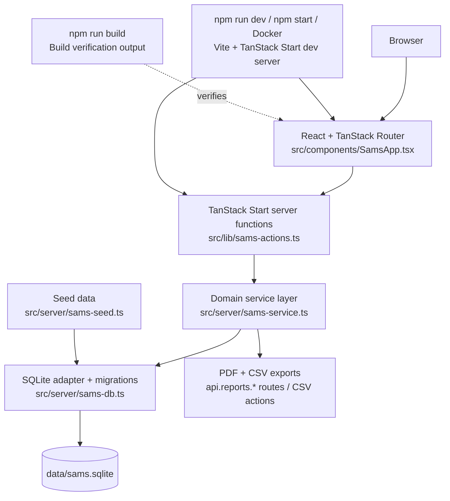
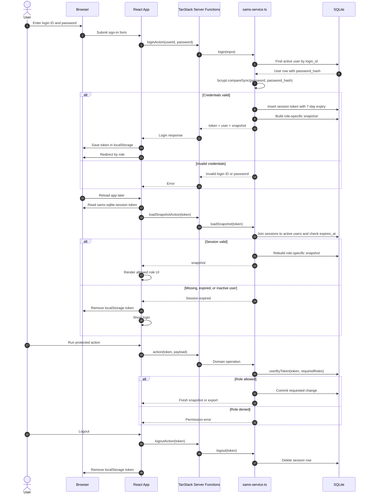
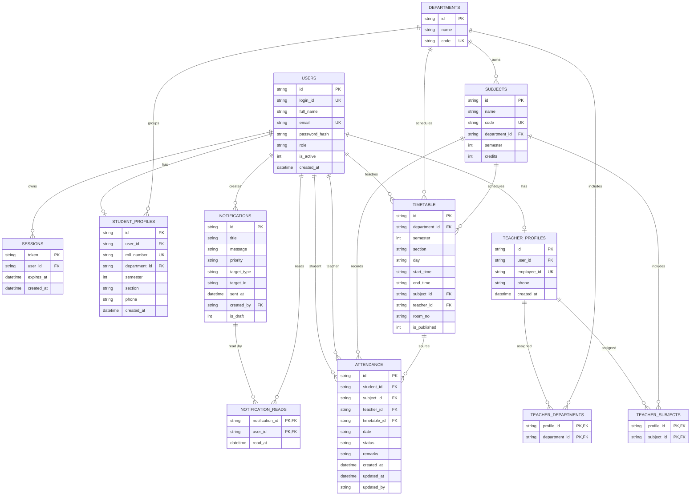

# Smart Attendance Management System (SAMS)

SAMS is a TanStack Start attendance platform for Admin, Teacher, and Student workflows. This rewrite keeps the original role-based features and replaces the old MongoDB/Express/Vite split with one SQLite-backed TanStack Start app.

## Stack

- React + TanStack Start + TanStack Router
- TypeScript
- Tailwind CSS v4 through the existing `src/styles.css`
- DaisyUI themes/components
- SQLite persisted at `data/sams.sqlite` locally, or `/tmp/sams.sqlite` on Vercel demo deployments, through `sql.js`
- PDFKit for student and teacher reports
- Nitro Vite adapter for Vercel deployment
- Installable PWA shell with a network-only service worker; SAMS is not designed to work offline

## Architecture



The app runs through TanStack Start's Vite dev server. `npm start` is an alias for `npm run dev`, and Docker uses `npm run dev` directly. `npm run build` is still kept as a verification step to catch bundle errors, but Docker does not run the built output.

## Authentication And Authorization Flow



The browser keeps only the opaque session token. Authorization is enforced on the server for every protected mutation/export by loading the session from SQLite and checking the required role.

## Database ER Diagram



## Run

### Local Development

```bash
npm install
npm run dev
```

Open [http://localhost:3000](http://localhost:3000).

### Build Verification

```bash
npm run typecheck
npm run build
```

This verifies the app compiles. Run `npm run dev` or `npm start` to serve it.

### Installable PWA

SAMS can be installed from supported desktop and mobile browsers. The app exposes `public/manifest.webmanifest`, app icons, and `public/sw.js`.

The service worker is intentionally network-only. It exists for installability and update control, but it does not cache pages, reports, API responses, or SQLite data for offline use.

### Vercel Demo Deployment

This repository is configured for simple Vercel deployment with the Nitro Vite adapter and `vercel.json`.

1. Push the repository to GitHub, GitLab, or Bitbucket.
2. Import the repository in Vercel.
3. Keep the detected framework preset as TanStack Start.
4. Keep the default build command, `npm run build`.
5. Do not set an output directory.
6. Deploy.

No database environment variable is required for a demo deployment. When `VERCEL` is present and `SAMS_DB_FILE` is not set, the app uses:

```bash
/tmp/sams.sqlite
```

The seed is automatic. On first access, `src/server/sams-db.ts` creates the SQLite file, runs migrations, checks whether `users` is empty, and inserts the seeded admin, teachers, students, timetable, attendance history, and notifications.

PDF exports are also bundled for Vercel. The build traces PDFKit and its font/profile data files into the server function so student and teacher reports can be downloaded from hosted deployments.

Important Vercel storage behavior:

- Vercel Functions have a read-only filesystem except writable `/tmp` scratch space.
- `/tmp/sams.sqlite` is suitable for demos and preview testing.
- `/tmp` is not durable application storage. The database, sessions, and changes can reset across cold starts, function instances, and deployments.
- For real production data, replace the file-backed SQLite adapter with durable storage such as Turso/libSQL, Vercel Postgres/Neon, or run the Docker setup on a host with a persistent volume.

Optional explicit env var:

```bash
SAMS_DB_FILE=/tmp/sams.sqlite
```

### Docker Compose

```bash
docker compose up
```

Open [http://localhost:3000](http://localhost:3000).

If port 3000 is already in use, run `SAMS_PORT=3001 docker compose up` and open [http://localhost:3001](http://localhost:3001).

For Docker-based development with live file sync, run:

```bash
docker compose up --watch
```

The Compose watch setup syncs `src/`, `biome.json`, `tsconfig.json`, and `vite.config.ts` into the running container. Changes to `Dockerfile`, `.npmrc`, `package.json`, or `package-lock.json` trigger a rebuild because dependencies or the image may have changed.

`docker compose down -v` removes the `sams-data` volume. The next startup creates a fresh seeded SQLite database.

The Dockerfile intentionally uses the dev-server path: install dependencies, copy the app, create `data/`, and run `npm run dev`.

## Verify

```bash
npm run typecheck
npm run check
npm run build
npm run smoke
```

## Seeded Login Credentials

- Admin: `ADMIN001` / `Admin@123`
- Teacher: `TCH001` / `Teacher@123`
- Student: `STU001` / `Student@123`

The database is created and seeded automatically when `data/sams.sqlite` is missing.
Set `SAMS_DB_FILE` to use a different SQLite file, for example during smoke tests.

## Seeded Data

The seed creates:

- 8 departments: CS, IT, ECE, ME, EE, CE, BIO, MCA.
- 19 subjects across semesters 1, 3, 5, and 7.
- 12 teachers: `TCH001` through `TCH012`; all use `Teacher@123`.
- 50 students: `STU001` through `STU050`; all use `Student@123`.
- 420 published CS timetable slots across semesters 1, 3, 5, and 7, sections A/B/C.
- Attendance history for the last 30 calendar days, skipping Sundays.
- Starter notifications for all users and the CS department.

Known student samples:

- `STU001` is CS semester 1.
- `STU002` is CS semester 3.
- `STU003` is CS semester 5.
- `STU004` is CS semester 7.

Reset local seed data:

```bash
rm -f data/sams.sqlite
npm run dev
```

Reset Docker seed data:

```bash
docker compose down -v
docker compose up
```

## How To Test Everything

### 1) Automated Smoke Checks

Run:

```bash
npm run typecheck
npm run build
```

Start the app locally:

```bash
npm run dev
```

In another terminal:

```bash
curl -I http://localhost:3000
```

Expected result: `HTTP/1.1 200 OK`.

Docker smoke check:

```bash
SAMS_PORT=3001 docker compose up -d
curl -I http://localhost:3001
docker compose down
```

Expected result: `HTTP/1.1 200 OK`. Use `docker compose down -v` when you also want to remove seeded SQLite data.

Seeded-data and workflow smoke check:

```bash
npm run smoke
```

Expected result:

```json
{
  "admin": {
    "students": 50,
    "teachers": 12,
    "departments": 8
  },
  "teacherAttendance": {
    "rosterStudents": 5,
    "existingRecords": 5
  },
  "notificationRead": true
}
```

The exact `teacherAttendance.slot` and roster count depend on the first seeded slot assigned to `TCH001`.
`npm run smoke` uses and resets `data/sams-smoke.sqlite`; it does not modify `data/sams.sqlite`.

## Navigation And User Flows

### Global Flow

1. Open `/login`.
2. Pick a seeded role shortcut or enter credentials manually.
3. The app redirects by role:
   - Admin: `/`
   - Teacher: `/teacher/dashboard`
   - Student: `/`
4. Use the left navigation drawer on desktop or the menu button on mobile.
5. The top-bar bell and sidebar Notifications item show a highlighted unread count when messages need attention.
6. Use the moon icon in the top bar to switch DaisyUI themes.
7. Use Logout to clear the local session token.

### Admin Flow

Admin can manage the institution catalog, people, timetable, and notifications.

1. Dashboard `/`
   - Review total students, teachers, departments, and conducted classes.
   - Review attendance distribution.
   - Create departments.
   - Create subjects for a department, semester, and credit value.
   - Filter Faculty Attendance by department.
2. Students `/admin/students`
   - Filter by department and semester.
   - Search by student name, roll number, or email.
   - Export CSV with report metadata and escaped fields.
   - Add a student with full name, login ID, email, password, roll number, department, semester, and section.
   - Remove a student account.
3. Teachers `/admin/teachers`
   - Filter by department and semester.
   - Search by teacher name, employee ID, email, or subject.
   - Create a teacher with login credentials, employee ID, department, and assigned subjects.
   - Remove a teacher account.
4. Timetable `/admin/timetable`
   - Filter by department, semester, section, or search text.
   - Add a slot with day, time, room, subject, teacher, and published status.
   - Edit a slot from the Schedule table.
   - Publish all slots for a selected department/semester/section cohort.
   - Delete a slot and its attached attendance records.
5. Notifications `/admin/notifications`
   - Send global notices to every user.
   - Send department notices to everyone in a department.
   - Send direct student notices by selecting a department and student.
   - Send direct teacher notices by selecting a department and teacher.
   - Review sent notifications and unread/read state.

### Teacher Flow

Teacher can review their schedule, mark or revise attendance, export analysis, and read notices.

1. Dashboard `/teacher/dashboard`
   - Review current IST date/time.
   - Review today's assigned classes and pending/completed state.
   - Download the teacher PDF report.
2. Mark Attendance `/teacher/attendance`
   - Select department, semester, section, date, and assigned timetable slot.
   - Load roster.
   - Use bulk Present/Absent/Late buttons.
   - Change individual statuses and remarks.
   - Submit attendance.
   - Reopen the same or previous date later and save changes. Teachers can revise only their assigned slots.
   - Confirm saved-record badges, existing record count, and last-edited metadata.
3. Analysis `/teacher/analysis`
   - Filter by subject and status.
   - Search by student name, university roll, or class roll.
   - Export CSV with report/filter metadata and escaped fields.
   - Download the teacher PDF report.
4. Notifications `/teacher/notifications`
   - Read global, department, and direct teacher notices.
   - Mark unread notices as read.

### Student Flow

Student can review attendance, safe-zone status, timetable, reports, and notices.

1. Dashboard `/`
   - Review total classes, present, absent, and percentage.
   - Review subject-wise 75% safe-zone status.
   - Download the student PDF report.
2. Attendance `/attendance`
   - Filter personal records by subject.
   - Filter records by Present/Absent/Late.
   - Download the student PDF report.
3. Timetable `/timetable`
   - Review published slots for the student's department, semester, and section.
4. Notifications `/notifications`
   - Read global, department, and direct student notices.
   - Mark unread notices as read.

## Notifications And Messages

SAMS supports one-way administrative messages through the Notifications module.

To message someone:

1. Sign in as Admin.
2. Open `/admin/notifications`.
3. Enter Title and Message.
4. Choose a target:
   - Global: sends to every active user.
   - Department: sends to all students and teachers in that department.
   - Student: select a department, then select a student.
   - Teacher: select a department, then select a teacher.
5. Click Send.
6. The recipient reads it from `/notifications` for students or `/teacher/notifications` for teachers.
7. Recipients can mark the message as read.

Teacher-to-student chat and student-to-admin replies are not part of the original `./sams` feature set, so they are not shown in the UI unless implemented end to end.

## Exports

- Admin Students CSV: `/admin/students` -> Export CSV. Includes report metadata, generated timestamp, student rows, department, subject, and attendance counts.
- Teacher Analysis CSV: `/teacher/analysis` -> CSV. Includes report metadata, active filters, and escaped rows.
- Student PDF: dashboard or attendance page -> PDF. Includes profile, summary table, subject safe-zone table, and recent records.
- Teacher PDF: dashboard or analysis page -> PDF. Includes profile, summary table, and attendance records.

## Manual Test Checklist

### Admin Checklist

1. Sign in with `ADMIN001` / `Admin@123`.
2. Dashboard should show 50 students, 12 teachers, and 8 departments.
3. Open Students:
   - Filter by Computer Science and semester 1.
   - Search `STU001` or `Anjali`.
   - Export CSV.
   - Add a student with a unique login, email, and roll number.
   - Remove that added student.
4. Open Teachers:
   - Filter by Computer Science.
   - Search `TCH001` or `Amit`.
   - Create a teacher with a unique login/email/employee ID and at least one subject.
   - Remove that added teacher.
5. Open Timetable:
   - Filter CS, semester 1, section A.
   - Add a slot.
   - Edit a slot.
   - Publish the cohort.
   - Delete the slot you added.
6. Open Notifications:
   - Send a Global notification.
   - Send a Department notification to Computer Science.
   - Send a Student notification to `STU001`.
   - Send a Teacher notification to `TCH001`.

### Teacher Checklist

1. Sign out, then sign in with `TCH001` / `Teacher@123`.
2. Dashboard should show the IST date/time and assigned class summary.
3. Open Mark Attendance:
   - Select an assigned timetable slot.
   - Load roster.
   - Use a bulk status button, then change a few individual statuses.
   - Submit attendance.
   - Load the same roster/date again; saved statuses should persist with saved-record badges and last-edited metadata.
   - Change a previous date and save again; teachers are allowed to revise attendance for their own assigned slots.
4. Open Analysis:
   - Filter by subject and status.
   - Search a student name or roll number.
   - Export CSV.
   - Download the PDF report.
5. Open Notifications:
   - Confirm teacher-targeted, department, and global notifications are visible.
   - Mark one unread notification as read; the unread count should update.

### Student Checklist

1. Sign out, then sign in with `STU001` / `Student@123`.
2. Dashboard should show overall attendance and per-subject 75% safe-zone status.
3. Open Attendance:
   - Filter by subject.
   - Filter by status.
   - Download the PDF report.
4. Open Timetable:
   - Confirm published CS semester 1 section A slots are shown.
5. Open Notifications:
   - Confirm Global, CS Department, and direct student notifications appear after the admin sends them.
   - Mark one unread notification as read; the unread count should update.

## Features

- Session auth with role-based access control.
- Admin dashboard with institution metrics and faculty attendance.
- Admin student overview with subject-wise attendance, CSV export, add student, and remove student.
- Admin teacher assignment overview with create/remove teacher.
- Admin timetable portal with filter, add, edit, delete, and publish cohort actions.
- Admin notifications for global, department, student, and teacher targets.
- Student dashboard with 75% safe-zone calculations and subject alerts.
- Student attendance records, timetable, notifications, and PDF report export.
- Teacher dashboard with live IST schedule summary.
- Teacher attendance marking with roster loading, bulk updates, saved-record badges, edit history, and persisted SQLite upserts.
- Teacher analytics with filters, CSV export, and PDF report export.
- Teacher notifications with read receipts.
- Notification read receipts for all roles.

## Project Layout

```text
src/
├── components/SamsApp.tsx
├── lib/
│   ├── sams-actions.ts
│   └── sams-types.ts
├── routes/
│   ├── __root.tsx
│   ├── index.tsx
│   ├── admin.*.tsx
│   ├── teacher.*.tsx
│   ├── api.reports.*.ts
│   └── attendance/timetable/notifications/login routes
├── server/
│   ├── sams-db.ts
│   ├── sams-seed.ts
│   └── sams-service.ts
└── styles.css
```
